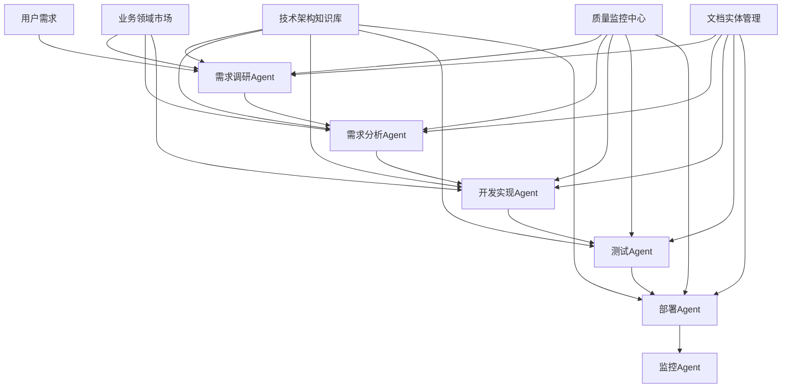

# 智能软件分析设计工具与AI驱动开发生态系统融合需求文档

## 1. 产品概述

智能软件分析设计工具是一个基于AI的软件工程辅助平台，用户只需提供原型图（PNG图片）和需求愿景（文字描述），系统即可自动生成完整的软件工程文档集合。在此基础上，我们将构建一个完整的AI驱动软件开发生态系统，实现从需求调研到部署运维的全流程自动化。

该工具旨在解决软件开发前期分析设计工作繁重、文档标准化程度低、团队协作效率不高等问题，为产品经理、系统分析师、架构师和开发团队提供一站式的需求分析和设计文档生成服务。通过多Agent协作、知识库管理、标准化流程和质量监控，最终达到"一人一公司"的理想场景，让个人开发者具备企业级的软件开发能力。

目标是成为软件开发行业的基础设施，为开发者提供智能化、标准化、可扩展的开发环境和工具链，大幅提升项目前期规划效率和文档质量。

## 2. 核心功能

### 2.1 用户角色

| 角色       | 注册方式 | 核心权限                               |
| -------- | ---- | ---------------------------------- |
| 普通用户     | 邮箱注册 | 可上传原型图和需求，生成基础文档，使用基础Agent服务       |
| 高级用户     | 付费升级 | 可生成完整文档集，支持自定义模板，使用高级Agent功能       |
| 企业用户     | 企业认证 | 团队协作，私有部署，API接口调用，私有知识库，定制化Agent配置 |
| Agent开发者 | 技能认证 | 开发和发布Agent插件、贡献知识库内容、获得插件收益        |
| 系统管理员    | 内部分配 | 平台管理、质量监控、标准制定、生态运营                |

### 2.2 功能模块

我们的智能软件分析设计工具与AI驱动开发生态系统包含以下核心页面：

**基础工具层（MVP功能）：**

1. **首页**：产品介绍、功能展示、快速开始引导
2. **项目创建页**：原型图上传、需求愿景输入、项目配置
3. **文档生成页**：AI分析进度、文档生成状态、实时预览
4. **文档管理页**：文档列表、编辑修改、版本管理、导出下载
5. **模板中心页**：预设模板、自定义模板、模板分享
6. **项目协作页**：团队成员管理、权限设置、评论讨论
7. **用户中心页**：个人信息、使用统计、订阅管理

**生态系统层（扩展功能）：**
8\. **智能开发工作台**：Agent协作中心、项目管理、实时监控
9\. **技术架构知识库**：技术文档管理、代码模板库、最佳实践、智能问答
10\. **流程化Agent管理**：Agent配置、工作流设计、任务调度
11\. **质量监控中心**：代码质量分析、测试覆盖率、性能监控
12\. **业务领域市场**：领域实体库、业务模板、行业解决方案、领域词汇管理
13\. **文档实体管理**：提示词模板、角色文档、开发规范
14\. **项目部署中心**：自动化部署、环境管理、运维监控
15\. **MCP协议控制台**：MCP服务器管理、API调用监控、Agent集成配置

### 2.3 页面详情

**基础工具层页面详情：**

| 页面名称  | 模块名称   | 功能描述                       |
| ----- | ------ | -------------------------- |
| 首页    | 产品介绍区  | 展示产品核心价值、功能特点、使用流程演示       |
| 首页    | 快速开始   | 提供示例项目、新手引导、立即体验入口         |
| 项目创建页 | 原型图上传  | 支持PNG/JPG格式，拖拽上传，图片预览和标注   |
| 项目创建页 | 需求输入   | 富文本编辑器，支持结构化需求描述，模板引导      |
| 项目创建页 | 项目配置   | 设置项目名称、类型、技术栈、生成选项         |
| 文档生成页 | AI分析引擎 | 图像识别解析，需求理解，智能分析进度显示       |
| 文档生成页 | 文档生成器  | 自动生成功能树、UML图、用例图、领域模型、领域词汇等多种文档 |
| 文档生成页 | 实时预览   | 分屏显示生成进度和文档预览，支持实时编辑，领域模型3D可视化展示 |
| 文档管理页 | 文档列表   | 展示所有生成的文档，分类筛选，搜索功能        |
| 文档管理页 | 在线编辑   | 支持文档在线修改，版本对比，协作编辑         |
| 文档管理页 | 导出下载   | 支持PDF、Word、Markdown等格式导出   |
| 模板中心页 | 模板库    | 提供行业标准模板，用户自定义模板管理         |
| 模板中心页 | 模板编辑器  | 可视化模板设计，字段配置，样式定制          |
| 项目协作页 | 团队管理   | 成员邀请，角色权限，协作工作流            |
| 项目协作页 | 评论系统   | 文档评论，修改建议，审批流程             |
| 用户中心页 | 个人资料   | 用户信息管理，偏好设置，API密钥          |
| 用户中心页 | 使用统计   | 项目数量，文档生成次数，存储使用情况         |

**生态系统层页面详情：**

| 页面名称       | 模块名称      | 功能描述                       |
| ---------- | --------- | -------------------------- |
| 智能开发工作台    | Agent协作中心 | 管理多个Agent的协作流程，实时查看任务状态和进度 |
| 智能开发工作台    | 项目管理      | 创建和管理开发项目，设置项目标准和质量要求      |
| 智能开发工作台    | 实时监控      | 监控开发进度、代码质量、测试结果等关键指标      |
| 技术架构知识库    | 技术文档管理    | 维护技术架构文档、API文档、集成指南等       |
| 技术架构知识库    | 代码模板库     | 提供可复用的代码模板、组件库、工具包         |
| 技术架构知识库    | 最佳实践      | 收集和分享开发最佳实践、设计模式、解决方案      |
| 技术架构知识库    | 智能问答系统    | 基于知识库内容的AI问答，支持技术咨询和解决方案推荐 |
| 流程化Agent管理 | 需求调研Agent | 自动化需求收集、分析、整理和文档化          |
| 流程化Agent管理 | 开发实现Agent | 基于需求自动生成代码、组件、接口等          |
| 流程化Agent管理 | 测试Agent   | 执行多种测试类型：功能、性能、接口、UI、安全测试  |
| 流程化Agent管理 | 部署Agent   | 自动化构建、部署、环境配置和运维监控         |
| 质量监控中心     | 代码质量分析    | 静态代码分析、代码规范检查、技术债务评估       |
| 质量监控中心     | 测试覆盖率     | 测试用例覆盖率统计、测试结果分析、缺陷跟踪      |
| 质量监控中心     | 完成度计算     | 基于配置标准计算项目完成度，提供改进建议       |
| 业务领域市场     | 领域实体库     | 提供各行业的标准领域模型、实体定义、业务规则     |
| 业务领域市场     | 业务模板      | 行业特定的项目模板、工作流模板、文档模板       |
| 业务领域市场     | 解决方案      | 完整的行业解决方案、参考架构、实施指南        |
| 业务领域市场     | 领域词汇管理    | 管理业务领域专业术语、概念定义、词汇关系图谱，支持AI理解和类命名引用 |
| 文档实体管理     | 提示词模板     | 管理各种Agent的提示词模板、角色定义、行为规范  |
| 文档实体管理     | 角色文档      | 定义各个开发角色的职责、技能要求、工作标准      |
| 文档实体管理     | 开发规范      | 代码规范、文档规范、流程规范、质量标准        |
| 项目部署中心     | 自动化部署     | 一键部署到各种环境，支持容器化和云原生部署      |
| 项目部署中心     | 环境管理      | 开发、测试、生产环境的配置和管理           |
| 项目部署中心     | 运维监控      | 应用性能监控、日志分析、告警管理           |
| MCP协议控制台    | MCP服务器管理  | 启动停止MCP服务器、配置端口和认证、监控服务状态  |
| MCP协议控制台    | 能力注册管理    | 注册新的MCP方法、管理API Schema、插件能力扩展 |
| MCP协议控制台    | 调用统计分析    | 实时监控API调用量、响应时间、成功率、错误分析   |
| MCP协议控制台    | Agent连接管理 | 管理Cursor等AI Agent的连接配置、权限控制、访问日志 |

## 3. 核心流程

### 3.1 基础工具使用流程

**主要用户操作流程：**

1. 用户登录系统，进入项目创建页面
2. 上传原型图片，系统进行图像预处理和识别
3. 输入需求愿景文字，配置项目参数
4. 启动AI分析，系统解析原型图和需求文本
5. 自动生成功能树、需求文档、UML图、用例图、领域模型等文档
6. 用户在文档管理页查看、编辑和完善生成的文档
7. 导出最终文档或邀请团队成员协作

**企业用户协作流程：**

1. 企业管理员创建团队，邀请成员
2. 项目负责人创建项目，分配权限
3. 团队成员协作完善文档内容
4. 通过评论和审批流程确保文档质量
5. 最终导出标准化的项目文档集

### 3.2 AI驱动开发生态流程

**完整开发流程**：用户提出需求 → 需求调研Agent分析 → 需求分析Agent细化 → 开发实现Agent编码 → 测试Agent验证 → 部署Agent上线 → 监控Agent运维

**质量保证流程**：每个环节都有对应的监控Agent进行质量检查，根据预设标准计算完成度，不达标则返回上一环节重新处理。

**知识库支持流程**：所有Agent在工作时都会查询技术架构知识库和业务领域市场，获取相关的文档、模板和最佳实践。

**MCP协议集成流程**：外部AI Agent（如Cursor）通过MCP协议调用系统功能 → MCP服务器接收请求并验证 → 路由到对应的文档生成引擎 → 返回标准化的响应结果 → AI Agent获取生成的文档和图表。

### 3.3 MCP协议调用流程

**Cursor等AI Agent的典型调用场景：**

1. **需求分析场景**：AI Agent发送需求描述 → 调用`generateUseCase`方法 → 获取用例图和用例文档
2. **架构设计场景**：AI Agent提供业务上下文 → 调用`generateDomainModel`方法 → 获取领域模型和实体关系图
3. **文档生成场景**：AI Agent指定文档类型和输入数据 → 调用`generateDocument`方法 → 获取自定义格式的技术文档
4. **图表创建场景**：AI Agent提供图表数据 → 调用`generateChart`方法 → 获取Mermaid格式的可视化图表
5. **能力查询场景**：AI Agent查询系统能力 → 调用`getCapabilities`方法 → 获取所有可用的MCP方法和参数说明



## 4. 用户界面设计

### 4.1 设计风格

* **主色调**：科技蓝 (#2563EB) 和纯白 (#FFFFFF)

* **辅助色**：浅灰 (#F8FAFC)、成功绿 (#10B981)、警告橙 (#F59E0B)、错误红 (#EF4444)

* **按钮样式**：圆角矩形，渐变效果，悬停动画，支持3D效果

* **字体**：中文使用苹方/微软雅黑，英文使用 Inter，代码使用 Fira Code

* **字号**：标题 24px，正文 16px，说明文字 14px

* **布局风格**：卡片式设计，左侧导航，响应式布局，支持深色模式

* **图标风格**：线性图标，统一的设计语言，支持动画效果和深色模式适配

### 4.2 页面设计概览

**基础工具层页面设计：**

| 页面名称  | 模块名称   | UI元素                   |
| ----- | ------ | ---------------------- |
| 首页    | 产品介绍区  | 大图背景，渐变遮罩，动态演示视频，CTA按钮 |
| 首页    | 快速开始   | 卡片式布局，图标+文字，悬停效果，引导箭头  |
| 项目创建页 | 原型图上传  | 拖拽区域，虚线边框，上传进度条，图片缩略图  |
| 项目创建页 | 需求输入   | 富文本编辑器，工具栏，字数统计，自动保存提示 |
| 文档生成页 | AI分析引擎 | 进度环形图，状态指示器，动画效果，日志输出  |
| 文档生成页 | 实时预览   | 分屏布局，可调节分割线，标签页切换，全屏模式 |
| 文档管理页 | 文档列表   | 表格视图，筛选器，搜索框，批量操作，分页器  |
| 文档管理页 | 在线编辑   | 编辑器界面，工具栏，侧边栏，版本历史面板   |

**生态系统层页面设计：**

| 页面名称       | 模块名称      | UI元素                        |
| ---------- | --------- | --------------------------- |
| 智能开发工作台    | Agent协作中心 | 流程图可视化、实时状态指示器、进度条、任务卡片     |
| 智能开发工作台    | 项目管理      | 项目卡片网格、状态标签、进度环形图、操作按钮组     |
| 技术架构知识库    | 文档管理      | 树形目录结构、搜索框、标签过滤、Markdown编辑器 |
| 流程化Agent管理 | Agent配置   | 表单配置面板、拖拽式工作流设计器、参数设置面板     |
| 质量监控中心     | 监控面板      | 仪表盘图表、趋势图、告警列表、质量评分卡        |
| 业务领域市场     | 实体库       | 分类导航、实体卡片、关系图谱、详情抽屉         |
| 文档实体管理     | 模板管理      | 模板列表、代码编辑器、预览面板、版本控制        |
| 项目部署中心     | 部署管理      | 环境选择器、部署日志、状态监控、回滚按钮        |
| MCP协议控制台    | 服务器管理     | MCP服务器状态监控、端口配置、能力管理、日志查看   |
| MCP协议控制台    | API调用监控   | 请求响应统计、性能分析、错误追踪、调用历史记录     |
| MCP协议控制台    | Agent集成配置 | Cursor等AI Agent连接配置、认证管理、权限设置   |

### 4.3 响应式设计

产品采用桌面优先的设计策略，同时适配平板和移动设备。在移动端优化触摸交互，简化操作流程，确保核心功能在小屏幕上的可用性。支持手势操作和触摸友好的界面元素。

## 5. 技术架构与实现方案

### 5.1 核心技术实现思路

这个工具需要整合多项AI技术：

1. **图像识别与分析**：使用计算机视觉技术解析原型图
2. **自然语言处理**：理解需求愿景文本
3. **知识图谱构建**：建立业务逻辑关系
4. **代码生成**：自动生成API文档和SQL脚本
5. **图表生成**：创建各类UML图和架构图

### 5.2 系统架构

**基础工具层技术栈：**

* **前端**：React + TypeScript + Vite + Ant Design

* **后端**：Node.js + Express + AI模型集成

* **AI服务**：集成GPT-4V、Claude等多模态模型

* **图表生成**：Mermaid.js、PlantUML

* **文档生成**：Markdown + PDF导出

**生态系统层技术栈：**

* **前端扩展**：基于现有智能软件分析设计工具扩展

* **后端架构**：Node.js + Express + GraphQL，微服务架构

* **数据库**：PostgreSQL (关系数据) + Neo4j (知识图谱) + Redis (缓存)

* **AI服务**：集成GPT-4、Claude、本地LLM等多种AI模型

* **消息队列**：RabbitMQ，处理Agent间的异步通信

* **容器化**：Docker + Kubernetes，支持云原生部署

### 5.2 Agent架构

* **Agent框架**：基于LangChain构建，支持插件化扩展

* **通信协议**：扩展MCP协议，支持Agent间的标准化通信

* **任务调度**：基于优先级和依赖关系的智能调度算法

* **状态管理**：分布式状态管理，支持断点续传和错误恢复

### 5.3 MCP协议集成

**MCP协议是本系统的核心特性之一，为AI Agent提供标准化的接口调用能力。**

#### 5.3.1 MCP服务器实现

系统实现了完整的MCP协议服务器 (`MCPServer`)，提供以下核心能力：

**核心方法支持：**
* `generateUseCase` - 用例图生成
* `generateDomainModel` - 领域模型生成  
* `generateDomainVocabulary` - 领域词汇生成和管理
* `generateDocument` - 自定义文档生成
* `listDocumentTypes` - 文档类型查询
* `generateChart` - Mermaid图表生成
* `exportChart` - 图表导出
* `validateDocument` - 文档验证
* `queryKnowledgeBase` - 知识库智能问答
* `getCapabilities` - 能力查询
* `installPlugin` - 插件安装
* `listPlugins` - 插件管理

**协议规范：**
```typescript
// MCP请求格式
interface MCPRequest {
  id: string;
  method: string;
  params: any;
  timestamp: Date;
}

// MCP响应格式
interface MCPResponse {
  id: string;
  result?: any;
  error?: MCPError;
  timestamp: Date;
}

// 能力描述
interface MCPCapability {
  name: string;
  version: string;
  description: string;
  methods: string[];
  schemas: Record<string, any>;
}
```

#### 5.3.2 MCP客户端支持

提供标准化的MCP客户端 (`MCPClient`)，支持：
* HTTP请求封装和错误处理
* 标准化的API调用接口
* 响应解析和类型安全

#### 5.3.3 Cursor等AI Agent集成

**使用示例：**
```typescript
// Cursor Agent调用示例
const mcpClient = new MCPClient('http://localhost:3001');

// 生成用例图
const useCase = await mcpClient.generateUseCase(
  "用户登录系统，包含注册、登录、密码重置功能"
);

// 生成领域模型
const domainModel = await mcpClient.generateDomainModel(
  "电商平台，包含用户、商品、订单、支付等业务领域"
);

// 生成领域词汇
const vocabulary = await mcpClient.generateDomainVocabulary({
  domain: "电商平台",
  entities: ["用户", "商品", "订单", "支付"],
  businessContext: "B2C电商业务，支持多商户模式"
});

// 知识库智能问答
const answer = await mcpClient.queryKnowledgeBase({
  question: "如何实现分布式事务处理？",
  context: "微服务架构下的订单支付场景",
  includeCodeExamples: true
});

// 自定义文档生成
const customDoc = await mcpClient.generateDocument('api-spec', {
  endpoints: [
    { path: '/users', method: 'GET', description: 'Get all users' },
    { path: '/users', method: 'POST', description: 'Create user' }
  ]
});

// 生成流程图
const flowchart = await mcpClient.generateChart('flowchart', {
  nodes: [
    { id: 'start', type: 'start', name: 'Start' },
    { id: 'process1', type: 'process', name: 'Process Data' },
    { id: 'decision1', type: 'decision', name: 'Valid?' },
    { id: 'end', type: 'end', name: 'End' }
  ],
  edges: [
    { source: 'start', target: 'process1' },
    { source: 'process1', target: 'decision1' },
    { source: 'decision1', target: 'end', label: 'Yes' }
  ]
});
```

#### 5.3.4 部署配置

* **服务端口**：默认3001端口
* **API端点**：`/mcp` 接收POST请求
* **认证方式**：支持API Key和OAuth2
* **限流策略**：基于用户级别的请求频率限制
* **监控日志**：完整的请求响应日志和性能监控

#### 5.3.5 扩展能力

* **插件系统**：支持第三方开发者扩展MCP方法
* **自定义Schema**：支持业务特定的请求响应格式
* **批量操作**：支持批量文档生成和处理
* **异步处理**：支持长时间运行的文档生成任务
* **缓存机制**：智能缓存提升响应速度

**MCP协议使得本系统可以无缝集成到各种AI开发工具中，成为AI Agent生态系统的重要组成部分。**

### 5.4 知识库架构

* **文档存储**：支持Markdown、PDF、代码文件等多种格式

* **向量检索**：基于Embedding的语义搜索和相似度匹配

* **版本控制**：Git集成，支持文档版本管理和协作编辑

* **权限管理**：细粒度的访问控制和内容审核机制

* **智能问答系统**：基于RAG（检索增强生成）技术，提供技术咨询和解决方案推荐

* **领域词汇管理**：构建业务领域专业术语库，支持概念定义、词汇关系图谱和AI理解

### 5.5 领域词汇系统

**领域词汇是附属于领域模型的重要组成部分，用于帮助开发者和AI更好地理解业务领域中的专业术语和概念。**

#### 5.5.1 词汇数据结构

```typescript
// 领域词汇定义
interface DomainVocabulary {
  id: string;
  term: string;                    // 术语名称
  definition: string;              // 定义说明
  category: VocabularyCategory;    // 词汇分类
  synonyms: string[];              // 同义词
  relatedTerms: string[];          // 相关术语
  examples: string[];              // 使用示例
  domainModelId: string;           // 关联的领域模型ID
  entityReferences: string[];      // 引用的实体类名
  businessRules: string[];         // 相关业务规则
  createdBy: string;
  updatedAt: Date;
}

// 词汇分类
enum VocabularyCategory {
  ENTITY = 'entity',           // 实体类术语
  ATTRIBUTE = 'attribute',     // 属性术语
  RELATIONSHIP = 'relationship', // 关系术语
  BUSINESS_RULE = 'business_rule', // 业务规则术语
  PROCESS = 'process',         // 流程术语
  CONCEPT = 'concept'          // 概念术语
}
```

#### 5.5.2 核心功能

**1. 术语管理**
* 创建、编辑、删除领域术语
* 支持术语分类和标签管理
* 提供术语搜索和筛选功能
* 术语使用频率统计和热度分析

**2. 关系图谱**
* 可视化展示术语间的关系网络
* 支持同义词、上下位关系、关联关系
* 交互式图谱浏览和编辑
* 关系强度和重要性评分

**3. AI理解增强**
* 为AI模型提供领域上下文
* 支持术语消歧和语义理解
* 自动识别文档中的领域术语
* 提供术语建议和补全功能

**4. 类命名引用**
* 在创建实体类时提供术语建议
* 自动生成符合命名规范的类名
* 支持术语到代码的映射关系
* 提供命名一致性检查

#### 5.5.3 与领域模型的集成

**领域词汇与领域模型深度集成，形成完整的业务知识体系：**

* **实体映射**：每个领域实体都关联相应的术语定义
* **属性说明**：实体属性通过词汇库获得标准化定义
* **关系解释**：实体间关系通过术语关系得到语义增强
* **业务规则**：词汇库中的业务规则直接应用到领域模型
* **代码生成**：基于词汇定义生成更准确的代码注释和文档

#### 5.5.4 酷炫展示效果

**领域模型将采用现代化的3D可视化技术：**

* **3D实体图**：使用Three.js渲染立体的实体关系图
* **动态布局**：支持力导向布局、层次布局、圆形布局等多种算法
* **交互动画**：鼠标悬停、点击、拖拽等交互效果
* **主题切换**：支持多种视觉主题和配色方案
* **数据钻取**：点击实体可展开详细的属性和方法信息
* **关系高亮**：选中实体时高亮显示相关联的实体和关系
* **全景视图**：支持缩放、旋转、平移等3D导航操作
* **导出功能**：支持导出高清图片、SVG矢量图、3D模型文件

### 5.6 智能问答系统

**基于知识库内容构建的AI问答系统，为开发者提供即时的技术支持和解决方案推荐。**

#### 5.6.1 技术实现

* **RAG架构**：检索增强生成，结合向量检索和大语言模型
* **多模态支持**：支持文本、代码、图表等多种内容类型的问答
* **上下文理解**：维护对话上下文，支持多轮对话
* **实时更新**：知识库更新后自动重建索引

#### 5.6.2 问答能力

* **技术咨询**：回答技术实现、最佳实践、架构设计等问题
* **代码解释**：解释代码逻辑、设计模式、算法原理
* **故障排查**：基于错误信息提供解决方案
* **方案推荐**：根据需求推荐合适的技术方案和工具
* **学习指导**：提供学习路径和资源推荐

## 6. 实施方案

### 6.1 第一阶段：基础平台建设 (3个月)

* 扩展现有智能软件分析设计工具

* 构建Agent框架和通信协议

* 实现基础的知识库管理功能和智能问答系统

* 开发领域词汇管理系统，集成到领域模型中

* 实现领域模型的3D可视化展示效果

* 开发需求调研和开发实现Agent

### 6.2 第二阶段：核心Agent开发 (4个月)

* 完善测试Agent的多种测试能力

* 开发部署和监控Agent

* 构建质量监控和完成度计算系统

* 实现业务领域市场的基础功能，包含领域词汇库

* 完善MCP协议，增加领域词汇生成和知识库问答接口

* 优化AI理解能力，集成领域词汇上下文

### 6.3 第三阶段：生态完善 (3个月)

* 开发文档实体管理系统

* 完善用户界面和交互体验

* 建立Agent插件市场和开发者社区

* 进行大规模测试和性能优化

### 6.4 第四阶段：商业化运营 (持续)

* 推广"一人一公司"的理念和实践

* 建立行业合作伙伴关系

* 持续优化AI模型和算法

* 扩展到更多行业和场景

## 7. 成功指标

* **开发效率提升**：单人开发项目的完成时间缩短80%

* **代码质量**：自动生成代码的质量达到高级开发者水平

* **用户满意度**：平台用户满意度超过90%

* **生态规模**：吸引1000+Agent开发者，10000+企业用户

* **商业价值**：帮助用户实现"一人一公司"，创造显著的商业价值

## 8. 风险评估

* **技术风险**：AI模型的准确性和稳定性需要持续优化

* **市场风险**：用户接受度和行业标准化程度的不确定性

* **竞争风险**：大型科技公司可能推出类似产品

* **法律风险**：AI生成代码的知识产权和责任归属问题

## 9. 结论

AI驱动软件开发生态系统代表了软件开发行业的未来方向。通过构建完整的Agent协作体系、知识库管理和质量监控机制，我们可以实现真正的"一人一公司"场景，让个人开发者具备企业级的开发能力。这不仅是技术的创新，更是开发模式的革命。
