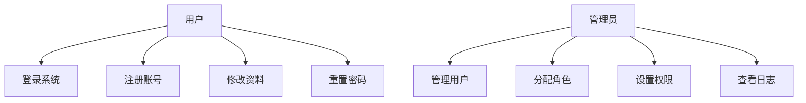
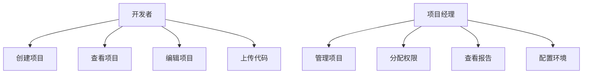
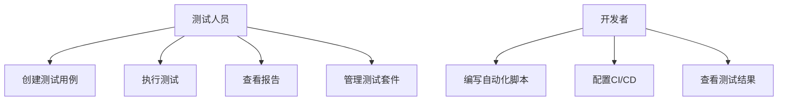
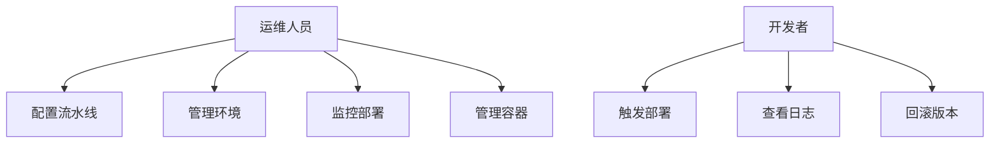

# 智能软件分析设计工具 - 后端接口需求文档

## 文档概述
本文档定义了智能软件分析设计工具的后端API接口规范，包括功能树、用例图、ER图、数据模型和接口定义。

## 1. 功能树

```
智能软件分析设计工具
├── 用户管理模块
│   ├── 用户认证
│   │   ├── 用户注册
│   │   ├── 用户登录
│   │   ├── 密码重置
│   │   └── 令牌刷新
│   ├── 用户信息管理
│   │   ├── 用户资料查看
│   │   ├── 用户资料编辑
│   │   └── 用户状态管理
│   └── 权限管理
│       ├── 角色管理
│       ├── 权限分配
│       └── 访问控制
├── 项目管理模块
│   ├── 项目CRUD
│   │   ├── 创建项目
│   │   ├── 查询项目
│   │   ├── 更新项目
│   │   └── 删除项目
│   ├── 项目配置
│   │   ├── Git仓库配置
│   │   ├── 技术栈配置
│   │   └── 环境配置
│   └── 项目协作
│       ├── 成员管理
│       ├── 权限分配
│       └── 活动日志
├── 代码分析模块
│   ├── 代码上传
│   │   ├── Git仓库克隆
│   │   ├── 文件上传
│   │   └── 代码解析
│   ├── 静态分析
│   │   ├── 语法分析
│   │   ├── 依赖分析
│   │   ├── 复杂度分析
│   │   └── 安全扫描
│   └── 智能分析
│       ├── 架构识别
│       ├── 模式识别
│       └── 优化建议
├── 文档管理模块
│   ├── 文档CRUD
│   │   ├── 创建文档
│   │   ├── 查询文档
│   │   ├── 更新文档
│   │   └── 删除文档
│   ├── 文档生成
│   │   ├── 自动生成
│   │   ├── 模板应用
│   │   └── 格式转换
│   └── 版本控制
│       ├── 版本创建
│       ├── 版本比较
│       └── 版本回滚
├── 核心资产模块
│   ├── 用例管理
│   │   ├── 用例CRUD
│   │   ├── 用例图生成
│   │   └── 用例关系管理
│   ├── 领域模型
│   │   ├── 实体管理
│   │   ├── 关系管理
│   │   └── 模型图生成
│   └── 系统架构
│       ├── 架构设计
│       ├── 组件管理
│       └── 架构图生成
├── 测试平台模块
│   ├── 测试用例管理
│   │   ├── 用例CRUD
│   │   ├── 用例执行
│   │   └── 结果记录
│   ├── 自动化测试
│   │   ├── UI自动化
│   │   ├── 接口自动化
│   │   └── 性能测试
│   └── 测试报告
│       ├── 报告生成
│       ├── 统计分析
│       └── 趋势分析
├── 部署平台模块
│   ├── CI/CD管理
│   │   ├── 流水线配置
│   │   ├── 流水线执行
│   │   └── 执行监控
│   ├── 环境管理
│   │   ├── 环境配置
│   │   ├── 环境监控
│   │   └── 环境部署
│   └── 容器管理
│       ├── 镜像管理
│       ├── 容器部署
│       └── 服务编排
└── 插件管理模块
    ├── 插件注册
    ├── 插件安装
    ├── 插件配置
    └── MCP协议支持
```

## 2. 用例图

### 2.1 用户管理用例


### 2.2 项目管理用例


### 2.3 测试平台用例


### 2.4 部署平台用例


## 3. ER图

```mermaid
erDiagram
    USER {
        string id PK
        string username
        string email
        string password_hash
        string full_name
        string avatar_url
        enum status
        datetime created_at
        datetime updated_at
    }
    
    ROLE {
        string id PK
        string name
        string description
        json permissions
        datetime created_at
    }
    
    PROJECT {
        string id PK
        string name
        string description
        string type
        json tech_stack
        json git_config
        string owner_id FK
        enum status
        datetime created_at
        datetime updated_at
    }
    
    PROJECT_MEMBER {
        string id PK
        string project_id FK
        string user_id FK
        string role
        datetime joined_at
    }
    
    DOCUMENT {
        string id PK
        string title
        text content
        string type
        string project_id FK
        string created_by FK
        string template_id FK
        integer version
        datetime created_at
        datetime updated_at
    }
    
    CODE_REPOSITORY {
        string id PK
        string project_id FK
        string url
        string branch
        string access_token
        json analysis_result
        datetime last_sync
    }
    
    USE_CASE {
        string id PK
        string project_id FK
        string name
        text description
        string actor
        text preconditions
        text main_flow
        text alternative_flows
        datetime created_at
    }
    
    DOMAIN_ENTITY {
        string id PK
        string project_id FK
        string name
        text description
        json attributes
        json relationships
        datetime created_at
    }
    
    SYSTEM_ARCHITECTURE {
        string id PK
        string project_id FK
        string name
        text description
        json components
        json connections
        string diagram_data
        datetime created_at
    }
    
    TEST_CASE {
        string id PK
        string project_id FK
        string name
        text description
        string type
        json steps
        json expected_results
        string status
        string created_by FK
        datetime created_at
    }
    
    TEST_EXECUTION {
        string id PK
        string test_case_id FK
        string executed_by FK
        string status
        text result
        json logs
        datetime executed_at
    }
    
    DEPLOYMENT_PIPELINE {
        string id PK
        string project_id FK
        string name
        text description
        json stages
        json triggers
        string status
        datetime created_at
    }
    
    DEPLOYMENT_ENVIRONMENT {
        string id PK
        string project_id FK
        string name
        string type
        json config
        string status
        datetime created_at
    }
    
    DEPLOYMENT_RECORD {
        string id PK
        string pipeline_id FK
        string environment_id FK
        string version
        string status
        string deployed_by FK
        json logs
        datetime started_at
        datetime completed_at
    }
    
    DOCKER_IMAGE {
        string id PK
        string project_id FK
        string name
        string tag
        string registry
        string size
        string status
        datetime created_at
    }
    
    USER ||--o{ PROJECT_MEMBER : "belongs to"
    PROJECT ||--o{ PROJECT_MEMBER : "has"
    USER ||--o{ ROLE : "has"
    PROJECT ||--o{ DOCUMENT : "contains"
    PROJECT ||--o{ CODE_REPOSITORY : "has"
    PROJECT ||--o{ USE_CASE : "contains"
    PROJECT ||--o{ DOMAIN_ENTITY : "contains"
    PROJECT ||--o{ SYSTEM_ARCHITECTURE : "contains"
    PROJECT ||--o{ TEST_CASE : "contains"
    TEST_CASE ||--o{ TEST_EXECUTION : "has"
    PROJECT ||--o{ DEPLOYMENT_PIPELINE : "contains"
    PROJECT ||--o{ DEPLOYMENT_ENVIRONMENT : "contains"
    DEPLOYMENT_PIPELINE ||--o{ DEPLOYMENT_RECORD : "has"
    DEPLOYMENT_ENVIRONMENT ||--o{ DEPLOYMENT_RECORD : "targets"
    PROJECT ||--o{ DOCKER_IMAGE : "contains"
```



## 4. 数据模型定义

### 4.1 用户模型
```typescript
interface User {
  id: string;
  username: string;
  email: string;
  passwordHash: string;
  fullName: string;
  avatarUrl?: string;
  status: 'active' | 'inactive' | 'suspended';
  roles: string[];
  createdAt: Date;
  updatedAt: Date;
}

interface Role {
  id: string;
  name: string;
  description: string;
  permissions: Permission[];
  createdAt: Date;
}

interface Permission {
  resource: string;
  actions: string[];
}
```

### 4.2 项目模型
```typescript
interface Project {
  id: string;
  name: string;
  description: string;
  type: 'web' | 'mobile' | 'desktop' | 'api' | 'library';
  techStack: {
    frontend?: string[];
    backend?: string[];
    database?: string[];
    tools?: string[];
  };
  gitConfig: {
    url: string;
    branch: string;
    accessToken?: string;
  };
  ownerId: string;
  members: ProjectMember[];
  status: 'active' | 'archived' | 'deleted';
  createdAt: Date;
  updatedAt: Date;
}

interface ProjectMember {
  id: string;
  projectId: string;
  userId: string;
  role: 'owner' | 'admin' | 'developer' | 'viewer';
  joinedAt: Date;
}
```

### 4.3 测试模型
```typescript
interface TestCase {
  id: string;
  projectId: string;
  name: string;
  description: string;
  type: 'unit' | 'integration' | 'e2e' | 'performance' | 'security';
  priority: 'low' | 'medium' | 'high' | 'critical';
  steps: TestStep[];
  expectedResults: string[];
  status: 'draft' | 'active' | 'deprecated';
  createdBy: string;
  createdAt: Date;
  updatedAt: Date;
}

interface TestStep {
  id: string;
  order: number;
  action: string;
  data?: any;
  expectedResult: string;
}

interface TestExecution {
  id: string;
  testCaseId: string;
  executedBy: string;
  status: 'passed' | 'failed' | 'skipped' | 'blocked';
  result: string;
  logs: string[];
  duration: number;
  executedAt: Date;
}
```

### 4.4 部署模型
```typescript
interface DeploymentPipeline {
  id: string;
  projectId: string;
  name: string;
  description: string;
  stages: PipelineStage[];
  triggers: {
    manual: boolean;
    webhook: boolean;
    schedule?: string;
  };
  status: 'active' | 'inactive' | 'draft';
  createdAt: Date;
  updatedAt: Date;
}

interface PipelineStage {
  id: string;
  name: string;
  type: 'build' | 'test' | 'deploy' | 'approval' | 'notification';
  order: number;
  config: any;
  conditions?: any;
}

interface DeploymentEnvironment {
  id: string;
  projectId: string;
  name: string;
  type: 'development' | 'testing' | 'staging' | 'production';
  config: {
    url: string;
    server: string;
    database?: string;
    variables: Record<string, string>;
  };
  status: 'healthy' | 'unhealthy' | 'deploying' | 'offline';
  createdAt: Date;
}

interface DeploymentRecord {
  id: string;
  pipelineId: string;
  environmentId: string;
  version: string;
  status: 'pending' | 'running' | 'success' | 'failed' | 'cancelled';
  deployedBy: string;
  commitHash: string;
  logs: string[];
  startedAt: Date;
  completedAt?: Date;
}
```

## 5. API接口定义

### 5.1 用户管理接口

#### 用户认证
```typescript
// POST /api/auth/register
interface RegisterRequest {
  username: string;
  email: string;
  password: string;
  fullName: string;
}

interface RegisterResponse {
  user: User;
  token: string;
}

// POST /api/auth/login
interface LoginRequest {
  email: string;
  password: string;
}

interface LoginResponse {
  user: User;
  token: string;
  refreshToken: string;
}

// POST /api/auth/refresh
interface RefreshRequest {
  refreshToken: string;
}

interface RefreshResponse {
  token: string;
}

// POST /api/auth/reset-password
interface ResetPasswordRequest {
  email: string;
}
```

#### 用户管理
```typescript
// GET /api/users
interface GetUsersQuery {
  page?: number;
  limit?: number;
  search?: string;
  status?: string;
}

interface GetUsersResponse {
  users: User[];
  total: number;
  page: number;
  limit: number;
}

// GET /api/users/:id
interface GetUserResponse {
  user: User;
}

// PUT /api/users/:id
interface UpdateUserRequest {
  fullName?: string;
  email?: string;
  status?: string;
  roles?: string[];
}

// DELETE /api/users/:id
```

### 5.2 项目管理接口

```typescript
// POST /api/projects
interface CreateProjectRequest {
  name: string;
  description: string;
  type: string;
  techStack: any;
  gitConfig?: any;
}

interface CreateProjectResponse {
  project: Project;
}

// GET /api/projects
interface GetProjectsQuery {
  page?: number;
  limit?: number;
  search?: string;
  type?: string;
  status?: string;
}

interface GetProjectsResponse {
  projects: Project[];
  total: number;
}

// GET /api/projects/:id
interface GetProjectResponse {
  project: Project;
}

// PUT /api/projects/:id
interface UpdateProjectRequest {
  name?: string;
  description?: string;
  techStack?: any;
  gitConfig?: any;
  status?: string;
}

// DELETE /api/projects/:id

// POST /api/projects/:id/members
interface AddMemberRequest {
  userId: string;
  role: string;
}

// PUT /api/projects/:id/members/:userId
interface UpdateMemberRequest {
  role: string;
}

// DELETE /api/projects/:id/members/:userId
```

### 5.3 代码分析接口

```typescript
// POST /api/projects/:id/code/upload
interface UploadCodeRequest {
  type: 'git' | 'file';
  gitUrl?: string;
  branch?: string;
  accessToken?: string;
  files?: File[];
}

interface UploadCodeResponse {
  repositoryId: string;
  status: string;
}

// GET /api/projects/:id/code/analysis
interface GetAnalysisResponse {
  repository: CodeRepository;
  analysis: {
    structure: any;
    dependencies: any;
    complexity: any;
    security: any;
    suggestions: any;
  };
}

// POST /api/projects/:id/code/analyze
interface AnalyzeCodeRequest {
  repositoryId: string;
  analysisType: string[];
}

interface AnalyzeCodeResponse {
  jobId: string;
  status: string;
}

// GET /api/projects/:id/code/analysis/:jobId
interface GetAnalysisJobResponse {
  job: {
    id: string;
    status: string;
    progress: number;
    result?: any;
    error?: string;
  };
}
```

### 5.4 测试平台接口

```typescript
// POST /api/projects/:id/test-cases
interface CreateTestCaseRequest {
  name: string;
  description: string;
  type: string;
  priority: string;
  steps: TestStep[];
  expectedResults: string[];
}

// GET /api/projects/:id/test-cases
interface GetTestCasesQuery {
  page?: number;
  limit?: number;
  type?: string;
  status?: string;
}

// POST /api/test-cases/:id/execute
interface ExecuteTestRequest {
  environment?: string;
  parameters?: any;
}

interface ExecuteTestResponse {
  executionId: string;
  status: string;
}

// GET /api/test-executions/:id
interface GetTestExecutionResponse {
  execution: TestExecution;
}

// GET /api/projects/:id/test-reports
interface GetTestReportsQuery {
  startDate?: string;
  endDate?: string;
  type?: string;
}

interface GetTestReportsResponse {
  reports: {
    summary: {
      total: number;
      passed: number;
      failed: number;
      skipped: number;
    };
    details: TestExecution[];
    trends: any[];
  };
}
```

### 5.5 部署平台接口

```typescript
// POST /api/projects/:id/pipelines
interface CreatePipelineRequest {
  name: string;
  description: string;
  stages: PipelineStage[];
  triggers: any;
}

// GET /api/projects/:id/pipelines
interface GetPipelinesResponse {
  pipelines: DeploymentPipeline[];
}

// POST /api/pipelines/:id/run
interface RunPipelineRequest {
  parameters?: any;
  environmentId?: string;
}

interface RunPipelineResponse {
  deploymentId: string;
  status: string;
}

// GET /api/deployments/:id
interface GetDeploymentResponse {
  deployment: DeploymentRecord;
  logs: string[];
}

// POST /api/projects/:id/environments
interface CreateEnvironmentRequest {
  name: string;
  type: string;
  config: any;
}

// GET /api/projects/:id/environments
interface GetEnvironmentsResponse {
  environments: DeploymentEnvironment[];
}

// POST /api/projects/:id/docker/build
interface BuildImageRequest {
  name: string;
  tag: string;
  dockerfile?: string;
  context?: string;
}

interface BuildImageResponse {
  buildId: string;
  status: string;
}

// GET /api/projects/:id/docker/images
interface GetDockerImagesResponse {
  images: DockerImage[];
}
```

### 5.6 文档管理接口

```typescript
// POST /api/projects/:id/documents
interface CreateDocumentRequest {
  title: string;
  content: string;
  type: string;
  templateId?: string;
}

// GET /api/projects/:id/documents
interface GetDocumentsQuery {
  page?: number;
  limit?: number;
  type?: string;
  search?: string;
}

// PUT /api/documents/:id
interface UpdateDocumentRequest {
  title?: string;
  content?: string;
}

// POST /api/documents/:id/generate
interface GenerateDocumentRequest {
  templateId: string;
  data: any;
  format: 'html' | 'pdf' | 'docx';
}

interface GenerateDocumentResponse {
  jobId: string;
  status: string;
}

// GET /api/documents/generate/:jobId
interface GetGenerationJobResponse {
  job: {
    id: string;
    status: string;
    progress: number;
    downloadUrl?: string;
    error?: string;
  };
}
```

### 5.7 核心资产接口

```typescript
// POST /api/projects/:id/use-cases
interface CreateUseCaseRequest {
  name: string;
  description: string;
  actor: string;
  preconditions: string;
  mainFlow: string;
  alternativeFlows?: string;
}

// GET /api/projects/:id/use-cases
interface GetUseCasesResponse {
  useCases: UseCase[];
}

// POST /api/projects/:id/domain-entities
interface CreateDomainEntityRequest {
  name: string;
  description: string;
  attributes: any[];
  relationships: any[];
}

// GET /api/projects/:id/domain-entities
interface GetDomainEntitiesResponse {
  entities: DomainEntity[];
}

// POST /api/projects/:id/architectures
interface CreateArchitectureRequest {
  name: string;
  description: string;
  components: any[];
  connections: any[];
}

// GET /api/projects/:id/architectures
interface GetArchitecturesResponse {
  architectures: SystemArchitecture[];
}

// POST /api/projects/:id/generate-diagram
interface GenerateDiagramRequest {
  type: 'usecase' | 'domain' | 'architecture';
  data: any;
  format: 'mermaid' | 'plantuml' | 'svg';
}

interface GenerateDiagramResponse {
  diagram: string;
  format: string;
}
```

## 6. 错误处理

### 6.1 错误响应格式
```typescript
interface ErrorResponse {
  error: {
    code: string;
    message: string;
    details?: any;
    timestamp: string;
    requestId: string;
  };
}
```

### 6.2 常见错误码
- `AUTH_001`: 认证失败
- `AUTH_002`: 令牌过期
- `AUTH_003`: 权限不足
- `PROJ_001`: 项目不存在
- `PROJ_002`: 项目访问被拒绝
- `FILE_001`: 文件上传失败
- `FILE_002`: 文件格式不支持
- `ANAL_001`: 代码分析失败
- `DEPL_001`: 部署失败
- `TEST_001`: 测试执行失败

## 7. 安全要求

### 7.1 认证和授权
- 使用JWT令牌进行身份认证
- 实现基于角色的访问控制(RBAC)
- 支持令牌刷新机制
- 实现API限流

### 7.2 数据安全
- 敏感数据加密存储
- 传输层使用HTTPS
- 实现数据脱敏
- 定期安全审计

### 7.3 输入验证
- 所有输入参数验证
- SQL注入防护
- XSS攻击防护
- 文件上传安全检查

## 8. 性能要求

### 8.1 响应时间
- API响应时间 < 200ms (95%)
- 文件上传 < 30s (100MB)
- 代码分析 < 5min (中等项目)
- 文档生成 < 30s

### 8.2 并发处理
- 支持1000并发用户
- 支持100并发API请求
- 支持10并发代码分析任务

### 8.3 可扩展性
- 水平扩展支持
- 数据库分片支持
- 缓存策略
- 异步任务处理

---

**文档版本**: v1.0.0
**最后更新**: 2024-12-20
**维护人员**: 后端开发团队
