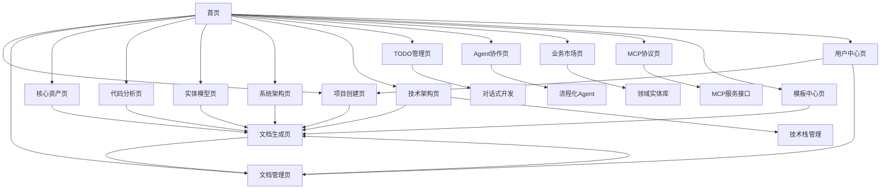

# 智能软件分析设计工具产品需求文档

## 1. 产品概述

智能软件分析设计工具是一个基于AI的软件工程辅助平台，用户只需提供原型图（PNG图片）和需求愿景（文字描述），系统即可自动生成完整的软件工程文档集合。在此基础上，我们将构建一个完整的AI驱动软件开发生态系统，实现从需求调研到部署运维的全流程自动化。

该工具旨在解决软件开发前期分析设计工作繁重、文档标准化程度低、团队协作效率不高等问题，为产品经理、系统分析师、架构师和开发团队提供一站式的需求分析和设计文档生成服务。通过多Agent协作、知识库管理、标准化流程和质量监控，最终达到"一人一公司"的理想场景，让个人开发者具备企业级的软件开发能力。

目标是成为软件开发行业的基础设施，为开发者提供智能化、标准化、可扩展的开发环境和工具链，大幅提升项目前期规划效率和文档质量。

## 2. 核心功能

### 2.1 用户角色

| 角色 | 注册方式 | 核心权限 |
|------|----------|----------|
| 默认用户 | 直接访问 | 可使用所有基础功能，包括项目创建、文档生成、模板使用等 |

### 2.2 功能模块

我们的智能软件分析设计工具与AI驱动开发生态系统包含以下核心页面：

**基础工具层（核心功能）：**

1. **首页**: 项目概览、快速导航、最近项目
2. **项目创建页**: 原型图上传、需求输入、项目配置、Git仓库集成
3. **文档生成页**: AI分析、实时预览、多格式导出
4. **文档管理页**: 文档列表、版本控制、协作编辑
5. **项目协作页**: 团队管理、权限控制、协作工具
6. **模板中心页**: 模板库、自定义模板、模板分享
7. **用户中心页**: 个人设置、使用统计、偏好配置

**AI驱动生态层（扩展功能）：**

8. **智能开发工作台**: Agent协作中心、项目管理、实时监控
9. **代码分析页**: 代码结构分析、类接口搜索、关系图展示
10. **实体模型页**: ER图设计、实体关系管理、数据建模
11. **系统架构页**: 模块关系图、架构分析、依赖管理
12. **技术架构页**: 技术栈管理、知识库检索、上下文增强
13. **TODO管理页**: 对话式开发、完成度评估、流程监控
14. **Agent协作页**: 流程化Agent、测试系统、一人一公司
15. **业务市场页**: 领域实体库、业务模板、实体关系图
16. **MCP协议页**: 服务接口、上下文查询、Agent协作

### 2.3 页面详情

**基础工具层页面详情：**

| 页面名称 | 模块名称 | 功能描述 |
|---------|---------|----------|
| 首页 | 项目概览 | 显示项目统计信息、最近访问项目、快速操作入口 |
| 首页 | 导航菜单 | 提供主要功能模块的快速访问链接 |
| 首页 | 最近项目 | 展示最近编辑的项目列表，支持快速打开和搜索 |
| 项目创建页 | 项目配置 | 输入项目基本信息、选择项目类型、设置项目参数 |
| 项目创建页 | Git集成 | 配置Git仓库地址、Token认证、代码导入设置 |
| 项目创建页 | 需求输入 | 支持文本输入、文件上传、原型图导入等多种需求录入方式 |
| 文档生成页 | AI分析引擎 | 基于需求自动生成各类技术文档、支持多种文档类型 |
| 文档生成页 | 实时预览 | 提供文档实时预览、编辑功能、格式调整 |
| 文档生成页 | 导出功能 | 支持PDF、Word、Markdown等多种格式导出 |
| 文档管理页 | 文档列表 | 展示所有项目文档、支持分类筛选、搜索功能 |
| 文档管理页 | 版本控制 | 文档版本管理、历史记录查看、版本对比 |
| 文档管理页 | 协作编辑 | 多人协作编辑、评论功能、权限管理 |
| 项目协作页 | 团队管理 | 成员邀请，角色权限，协作工作流 |
| 项目协作页 | 评论系统 | 文档评论，修改建议，审批流程 |
| 模板中心页 | 模板库 | 提供丰富的文档模板、支持模板预览和下载 |
| 模板中心页 | 自定义模板 | 支持用户创建和编辑自定义文档模板 |
| 模板中心页 | 模板分享 | 模板分享功能、评分系统、使用统计 |
| 用户中心页 | 个人设置 | 用户信息管理、偏好设置、主题配置 |
| 用户中心页 | 项目管理 | 个人项目列表、项目权限、协作邀请 |
| 用户中心页 | 协作权限 | 团队成员管理、权限分配、访问控制 |

**AI驱动生态层页面详情：**

| 页面名称 | 模块名称 | 功能描述 |
|---------|---------|----------|
| 智能开发工作台 | Agent协作中心 | 管理多个Agent的协作流程，实时查看任务状态和进度 |
| 智能开发工作台 | 项目管理 | 创建和管理开发项目，设置项目标准和质量要求 |
| 智能开发工作台 | 实时监控 | 监控开发进度、代码质量、测试结果等关键指标 |
| 代码分析页 | 代码结构分析 | 自动分析代码结构、生成架构图、识别设计模式 |
| 代码分析页 | 类接口搜索 | 智能搜索关键类和接口、功能定位、代码导航 |
| 代码分析页 | 关系图展示 | 生成类图、接口关系图、依赖关系可视化 |
| 实体模型页 | ER图设计器 | 数据库实体关系图设计、表结构定义、关系建模 |
| 实体模型页 | 实体管理 | 业务实体定义、属性配置、约束规则设置 |
| 实体模型页 | 数据建模 | 概念模型、逻辑模型、物理模型设计 |
| 系统架构页 | 模块关系图 | 系统模块间关系可视化、层级结构展示 |
| 系统架构页 | 架构分析 | 架构质量评估、性能分析、优化建议 |
| 系统架构页 | 依赖管理 | 模块依赖关系管理、循环依赖检测、解耦建议 |
| 技术架构页 | 技术栈管理 | 维护技术架构文档，提供技术选型和集成指导 |
| 技术架构页 | 知识库检索 | 搜索技术工具文档、最佳实践和使用指南 |
| 技术架构页 | 上下文增强 | 将技术文档加入AI上下文，提升代码生成质量 |
| TODO管理页 | 对话式开发 | 通过对话形式对组件文件进行渐进式补充和完善 |
| TODO管理页 | 完成度评估 | 配置开发标准，实时评估任务完成度和代码质量 |
| TODO管理页 | 流程监控 | 监控开发进度，确保任务闭环管理 |
| Agent协作页 | 流程化Agent | 管理需求调研、分析、开发、测试、部署等Agent |
| Agent协作页 | 测试系统 | 集成性能、接口、功能、UI、安全等多维度测试 |
| Agent协作页 | 一人一公司 | 通过Agent协作实现个人开发团队完整能力 |
| 业务市场页 | 领域实体库 | 提供各行业标准业务实体和关系模型 |
| 业务市场页 | 业务模板 | 行业特定的业务流程模板和最佳实践 |
| 业务市场页 | 实体关系图 | 可视化业务实体间复杂关系和依赖 |
| MCP协议页 | 服务接口 | 为AI Agent提供代码分析、文档生成等标准化接口 |
| MCP协议页 | 上下文查询 | 提供系统级、类级、业务级、技术级上下文信息 |
| MCP协议页 | Agent协作 | 支持Cursor等IDE插件和多Agent协同开发 |

## 3. 核心流程

### 3.1 基础工具使用流程

**主要用户操作流程：**

1. **项目创建流程**：用户创建新项目 → 配置Git仓库 → 导入代码 → 输入需求 → 自动分析生成项目概览
2. **文档生成流程**：选择文档类型 → AI分析项目内容 → 生成文档草稿 → 实时预览编辑 → 多格式导出
3. **文档管理流程**：查看文档列表 → 版本控制管理 → 协作编辑 → 权限管理 → 文档分享
4. **核心资产设计流程**：用例图设计 → 领域模型构建 → 业务流程设计 → 资产关联分析
5. **代码分析流程**：代码结构分析 → 类接口搜索 → 关系图生成 → 设计模式识别
6. **实体建模流程**：ER图设计 → 实体关系定义 → 数据模型构建 → 约束规则配置
7. **系统架构分析流程**：模块关系分析 → 架构质量评估 → 依赖管理 → 优化建议
8. **模板管理流程**：浏览模板库 → 自定义模板 → 模板分享 → 使用统计

**企业用户协作流程：**

1. 企业管理员创建团队，邀请成员
2. 项目负责人创建项目，分配权限
3. 团队成员协作完善文档内容
4. 通过评论和审批流程确保文档质量
5. 最终导出标准化的项目文档集

### 3.2 AI驱动开发生态流程

**扩展功能流程：**

9. **技术架构维护流程**：选择技术栈 → 获取文档指南 → AI增强上下文 → 生成技术方案 → 输出实施建议
10. **TODO开发流程**：发起对话 → AI分析需求 → 渐进式代码补充 → 质量评估监控 → 完成度验证
11. **Agent协作流程**：配置Agent角色 → 分配开发任务 → 多Agent协同工作 → 测试验证 → 部署交付
12. **业务市场流程**：选择行业领域 → 获取标准实体模型 → 应用业务模板 → 定制化调整 → 生成业务文档
13. **MCP集成流程**：配置MCP服务 → AI Agent调用 → 上下文查询 → 代码生成辅助

**完整开发流程**：用户提出需求 → 需求调研Agent分析 → 需求分析Agent细化 → 开发实现Agent编码 → 测试Agent验证 → 部署Agent上线 → 监控Agent运维

**质量保证流程**：每个环节都有对应的监控Agent进行质量检查，根据预设标准计算完成度，不达标则返回上一环节重新处理。

**知识库支持流程**：所有Agent在工作时都会查询技术架构知识库和业务领域市场，获取相关的文档、模板和最佳实践。

### 3.3 MCP协议调用流程

**MCP协议集成流程**：外部AI Agent（如Cursor）通过MCP协议调用系统功能 → MCP服务器接收请求并验证 → 路由到对应的文档生成引擎 → 返回标准化的响应结果 → AI Agent获取生成的文档和图表。

**Cursor等AI Agent的典型调用场景：**

1. **需求分析场景**：AI Agent发送需求描述 → 调用`generateUseCase`方法 → 获取用例图和用例文档
2. **架构设计场景**：AI Agent提供业务上下文 → 调用`generateDomainModel`方法 → 获取领域模型和实体关系图
3. **文档生成场景**：AI Agent指定文档类型和输入数据 → 调用`generateDocument`方法 → 获取自定义格式的技术文档
4. **图表创建场景**：AI Agent提供图表数据 → 调用`generateChart`方法 → 获取Mermaid格式的可视化图表
5. **能力查询场景**：AI Agent查询系统能力 → 调用`getCapabilities`方法 → 获取所有可用的MCP方法和参数说明

## 4. 用户界面设计

### 4.1 设计风格

* **主色调**：科技蓝 (#2563EB) 和纯白 (#FFFFFF)

* **辅助色**：浅灰 (#F8FAFC)、成功绿 (#10B981)、警告橙 (#F59E0B)

* **按钮样式**：圆角矩形，渐变效果，悬停动画

* **字体**：中文使用苹方/微软雅黑，英文使用 Inter，代码使用 Fira Code

* **字号**：标题 24px，正文 16px，说明文字 14px

* **布局风格**：卡片式设计，左侧导航，响应式布局

* **图标风格**：线性图标，统一的设计语言，支持深色模式

### 4.2 页面设计概览

**基础工具层页面设计：**

| 页面名称  | 模块名称   | UI元素                   |
| ----- | ------ | ---------------------- |
| 首页    | 产品介绍区  | 大图背景，渐变遮罩，动态演示视频，CTA按钮 |
| 首页    | 快速开始   | 卡片式布局，图标+文字，悬停效果，引导箭头  |
| 项目创建页 | 原型图上传  | 拖拽区域，虚线边框，上传进度条，图片缩略图  |
| 项目创建页 | 需求输入   | 富文本编辑器，工具栏，字数统计，自动保存提示 |
| 文档生成页 | AI分析引擎 | 进度环形图，状态指示器，动画效果，日志输出  |
| 文档生成页 | 实时预览   | 分屏布局，可调节分割线，标签页切换，全屏模式 |
| 文档管理页 | 文档列表   | 表格视图，筛选器，搜索框，批量操作，分页器  |
| 文档管理页 | 在线编辑   | 编辑器界面，工具栏，侧边栏，版本历史面板   |
| 项目协作页 | 团队管理   | 成员头像列表，权限标签，邀请按钮，角色选择器 |
| 模板中心页 | 模板库    | 网格布局，预览卡片，分类筛选，评分星级   |
| 用户中心页 | 个人设置   | 表单组件，开关按钮，头像上传，主题选择器   |

**AI驱动生态层页面设计：**

| 页面名称 | 模块名称 | UI元素 |
|-----------|-------------|-------------|
| 智能开发工作台 | Agent协作中心 | 流程图可视化、实时状态指示器、进度条、任务卡片 |
| 智能开发工作台 | 项目管理 | 项目卡片网格、状态标签、进度环形图、操作按钮组 |
| 代码分析页 | Git集成 | 仓库配置表单，连接状态指示，分支选择器，同步按钮 |
| 代码分析页 | 代码切片 | 代码树形结构，搜索高亮，快速定位，上下文面板 |
| 实体模型页 | ER图设计 | 拖拽式画布，实体工具箱，连线工具，属性面板 |
| 实体模型页 | 3D可视化 | Three.js渲染，交互控制，动画效果，主题切换 |
| 系统架构页 | 模块关系图 | 力导向布局，节点拖拽，关系线条，缩放控制 |
| 系统架构页 | 架构分析 | 分析报告面板，图表展示，建议列表，导出功能 |
| 技术架构页 | 知识库管理 | 树形目录结构、搜索框、标签过滤、Markdown编辑器 |
| TODO管理页 | 对话界面 | 聊天气泡、输入框、进度指示器、完成度仪表盘 |
| Agent协作页 | 流程设计器 | 拖拽式工作流画布、节点配置面板、连接线工具 |
| 业务市场页 | 实体库 | 分类导航、实体卡片、关系图谱、详情抽屉 |
| MCP协议页 | 服务控制台 | 服务器状态监控、端口配置、能力管理、日志查看 |

### 4.3 响应式设计

产品采用桌面优先的设计策略，同时适配平板和移动设备。在移动端优化触摸交互，简化操作流程，确保核心功能在小屏幕上的可用性。支持手势操作和触摸友好的界面元素。

 

***

# 智能软件分析设计工具。

 

## 5. 扩展功能模块

### 5.1 技术架构维护系统
- **技术栈知识库**: 维护开发技术架构文档，提供技术选型指导
- **集成工具管理**: 梳理和获取各种技术工具的使用文档和最佳实践
- **上下文增强**: 将技术架构文档加入AI上下文，提升代码生成质量
- **调包指南**: 为底层开发人员提供简化的技术使用指南

### 5.2 TODO开发流程管理
- **对话式开发**: 通过对话形式对组件和文件进行渐进式补充
- **完成度标准**: 配置和制定开发完成度的评估标准和计算公式
- **监控Agent**: 部署监控AI对开发进度和质量进行实时评估
- **闭环管理**: 确保开发任务从开始到完成的全流程可追踪

### 5.3 流程化Agent生态
- **需求调研Agent**: 自动化需求收集、分析和整理
- **需求分析Agent**: 智能需求分解、优先级排序、可行性分析
- **开发实现Agent**: 代码生成、架构设计、技术选型
- **测试环节Agent**: 多维度自动化测试执行和报告
- **部署环节Agent**: 自动化部署、监控、运维管理
- **一人一公司**: 通过Agent协作实现个人开发团队的完整能力

### 5.4 全方位测试系统
- **性能测试**: 系统性能基准测试、压力测试、负载测试
- **接口测试**: API接口自动化测试、契约测试、兼容性测试
- **功能测试**: 业务功能验证、用户场景测试、回归测试
- **UI自动化测试**: 界面交互测试、跨浏览器测试、响应式测试
- **安全测试**: 漏洞扫描、权限验证、数据安全测试

### 5.5 业务市场平台
- **领域实体库**: 提供各行业的标准业务实体和关系模型
- **业务模板市场**: 行业特定的业务流程模板和最佳实践
- **实体关系图**: 可视化业务实体间的复杂关系和依赖
- **行业标准**: 不同领域的业务规范和合规要求

### 5.6 Agent文档提示词系统
- **角色文档库**: 为不同Agent角色提供专业的基础文档
- **提示词模板**: 标准化的Agent指令模板和最佳实践
- **上下文管理**: 确保Agent在开发过程中不偏离既定目标
- **文档关联**: 强关联相关文档，提升Agent的专业能力
- **质量保证**: 通过文档约束确保输出质量和一致性

## 6. MCP协议集成

### 6.1 MCP服务接口
- **代码分析接口**: 为AI Agent提供代码结构分析、类接口搜索等服务
- **文档生成接口**: 支持AI Agent调用文档生成和模板应用功能
- **实体建模接口**: 提供ER图设计、实体关系管理的标准化接口
- **架构分析接口**: 系统架构分析、依赖管理的API服务

### 6.2 上下文查询系统
- **系统级上下文**: 提供项目整体架构和模块关系信息
- **类级上下文**: 详细的类结构、方法签名、依赖关系
- **业务上下文**: 业务流程、实体关系、业务规则信息
- **技术上下文**: 技术栈、框架使用、最佳实践指导

### 6.3 AI Agent协作
- **Cursor集成**: 为Cursor等IDE插件提供专业的代码生成支持
- **多Agent协调**: 支持多个AI Agent同时访问和协作开发
- **实时同步**: 确保多个Agent之间的信息同步和一致性
- **权限管理**: 不同Agent的访问权限和操作范围控制

