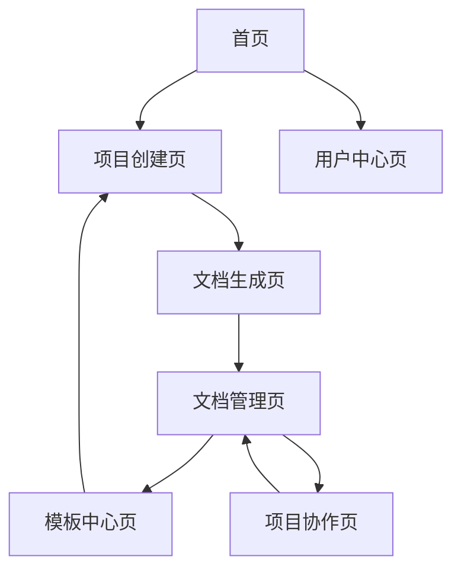

# 智能软件分析设计工具产品需求文档

## 1. 产品概述

智能软件分析设计工具是一个基于AI的软件工程辅助平台，用户只需提供原型图（PNG图片）和需求愿景（文字描述），系统即可自动生成完整的软件工程文档集合。

该工具旨在解决软件开发前期分析设计工作繁重、文档标准化程度低、团队协作效率不高等问题，为产品经理、系统分析师、架构师和开发团队提供一站式的需求分析和设计文档生成服务。

目标是成为软件开发团队必备的智能化设计工具，大幅提升项目前期规划效率和文档质量。

## 2. 核心功能

### 2.1 用户角色

| 角色   | 注册方式 | 核心权限              |
| ---- | ---- | ----------------- |
| 普通用户 | 邮箱注册 | 可上传原型图和需求，生成基础文档  |
| 高级用户 | 付费升级 | 可生成完整文档集，支持自定义模板  |
| 企业用户 | 企业认证 | 团队协作，私有部署，API接口调用 |

### 2.2 功能模块

我们的智能软件分析设计工具包含以下主要页面：

1. **首页**：产品介绍、功能展示、快速开始引导
2. **项目创建页**：原型图上传、需求愿景输入、项目配置
3. **文档生成页**：AI分析进度、文档生成状态、实时预览
4. **文档管理页**：文档列表、编辑修改、版本管理、导出下载
5. **模板中心页**：预设模板、自定义模板、模板分享
6. **项目协作页**：团队成员管理、权限设置、评论讨论
7. **用户中心页**：个人信息、使用统计、订阅管理

### 2.3 页面详情

| 页面名称  | 模块名称   | 功能描述                     |
| ----- | ------ | ------------------------ |
| 首页    | 产品介绍区  | 展示产品核心价值、功能特点、使用流程演示     |
| 首页    | 快速开始   | 提供示例项目、新手引导、立即体验入口       |
| 项目创建页 | 原型图上传  | 支持PNG/JPG格式，拖拽上传，图片预览和标注 |
| 项目创建页 | 需求输入   | 富文本编辑器，支持结构化需求描述，模板引导    |
| 项目创建页 | 项目配置   | 设置项目名称、类型、技术栈、生成选项       |
| 文档生成页 | AI分析引擎 | 图像识别解析，需求理解，智能分析进度显示     |
| 文档生成页 | 文档生成器  | 自动生成功能树、UML图、用例图等多种文档    |
| 文档生成页 | 实时预览   | 分屏显示生成进度和文档预览，支持实时编辑     |
| 文档管理页 | 文档列表   | 展示所有生成的文档，分类筛选，搜索功能      |
| 文档管理页 | 在线编辑   | 支持文档在线修改，版本对比，协作编辑       |
| 文档管理页 | 导出下载   | 支持PDF、Word、Markdown等格式导出 |
| 模板中心页 | 模板库    | 提供行业标准模板，用户自定义模板管理       |
| 模板中心页 | 模板编辑器  | 可视化模板设计，字段配置，样式定制        |
| 项目协作页 | 团队管理   | 成员邀请，角色权限，协作工作流          |
| 项目协作页 | 评论系统   | 文档评论，修改建议，审批流程           |
| 用户中心页 | 个人资料   | 用户信息管理，偏好设置，API密钥        |
| 用户中心页 | 使用统计   | 项目数量，文档生成次数，存储使用情况       |

## 3. 核心流程

**主要用户操作流程：**

1. 用户登录系统，进入项目创建页面
2. 上传原型图片，系统进行图像预处理和识别
3. 输入需求愿景文字，配置项目参数
4. 启动AI分析，系统解析原型图和需求文本
5. 自动生成功能树、需求文档、UML图等文档
6. 用户在文档管理页查看、编辑和完善生成的文档
7. 导出最终文档或邀请团队成员协作

**企业用户协作流程：**

1. 企业管理员创建团队，邀请成员
2. 项目负责人创建项目，分配权限
3. 团队成员协作完善文档内容
4. 通过评论和审批流程确保文档质量
5. 最终导出标准化的项目文档集

## 4. 用户界面设计

### 4.1 设计风格

* **主色调**：科技蓝 (#2563EB) 和纯白 (#FFFFFF)

* **辅助色**：浅灰 (#F8FAFC)、成功绿 (#10B981)、警告橙 (#F59E0B)

* **按钮样式**：圆角矩形，渐变效果，悬停动画

* **字体**：中文使用苹方/微软雅黑，英文使用 Inter，代码使用 Fira Code

* **字号**：标题 24px，正文 16px，说明文字 14px

* **布局风格**：卡片式设计，左侧导航，响应式布局

* **图标风格**：线性图标，统一的设计语言，支持深色模式

### 4.2 页面设计概览

| 页面名称  | 模块名称   | UI元素                   |
| ----- | ------ | ---------------------- |
| 首页    | 产品介绍区  | 大图背景，渐变遮罩，动态演示视频，CTA按钮 |
| 首页    | 快速开始   | 卡片式布局，图标+文字，悬停效果，引导箭头  |
| 项目创建页 | 原型图上传  | 拖拽区域，虚线边框，上传进度条，图片缩略图  |
| 项目创建页 | 需求输入   | 富文本编辑器，工具栏，字数统计，自动保存提示 |
| 文档生成页 | AI分析引擎 | 进度环形图，状态指示器，动画效果，日志输出  |
| 文档生成页 | 实时预览   | 分屏布局，可调节分割线，标签页切换，全屏模式 |
| 文档管理页 | 文档列表   | 表格视图，筛选器，搜索框，批量操作，分页器  |
| 文档管理页 | 在线编辑   | 编辑器界面，工具栏，侧边栏，版本历史面板   |

### 4.3 响应式设计

产品采用桌面优先的设计策略，同时适配平板和移动设备。在移动端优化触摸交互，简化操作流程，确保核心功能在小屏幕上的可用性。支持手势操作和触摸友好的界面元素。

 

***

# 智能软件分析设计工具。

 

## 功能包括：

### 输入

* 原型图（PNG图片）
* 需求愿景（文字描述）

### 输出

* 功能树
* 需求文档
* UML图（类图、时序图等）
* 用例图
* 领域模型
* OpenAPI接口文件
* MySQL SQL初始化表和测试数据
* 逻辑架构设计
* 业务架构设计
* 开发架构设计
* ERP图

## 技术实现思路

这个工具需要整合多项AI技术：

1.  
   1.  
   图像识别与分析 ：使用计算机视觉技术解析原型图
2.  
   1.  
   自然语言处理 ：理解需求愿景文本
3.  
   1.  
   知识图谱构建 ：建立业务逻辑关系
4.  
   1.  
   代码生成 ：自动生成API文档和SQL脚本
5.  
   1.  
   图表生成 ：创建各类UML图和架构图

## 建议的实现方案

* 前端 ：React + TypeScript + Ant Design
* 后端 ：Node.js + Express + AI模型集成
* AI服务 ：集成GPT-4V、Claude等多模态模型
* 图表生成 ：Mermaid.js、
* 文档生成 ：Markdown + PDF导出
  这是一个非常有前景的产品想法，可以大大提升软件开发的效率。如果您希望开始实现这个项目，我可以帮您创建详细的需求文档和技术架构设计。

 

* \[ ]还有一个就是维护开发技术架构, 因为底层开发的人不需要知道到底原理， 只要调包就好了， 所以如果把需要集成的技术架构的工具， 有梳理和获取的知识库文档， 将其加入上下文， 其实也能很好的进行一个， 代码生成
*  还有就是TODO 这件事， 开发代码的研发流程， 通过对话的形式进行对我们的组件部分文件进行补充， 到底补充到什么程度才算可以， 这个得配置制定标准， 也就是我们说的闭环， 这个需要有一个计算公式，去做， 也就是监控者的AI去做， 或者说测试agent去做 ，他们是环节中的测试， 

  有一个理念就是流程行agent， 需求调研， 需求分析， 开发实现， 测试环节， 部署环节都可持续的有agent再代替人做这个事， 而我们人成为制定计划标准那么是否就可以形成一人一公司的场景

 

毕竟， 测试中也分为了 性能测试， 接口测试， 功能测试，UI自动化测试， 安全测试，

 

&#x20;那么我们再做一个业务市场， 提供业务的领域实体可以作为基础。

再弄一个agent 文档提示词的文档实体， 可以指挥出每个角色所需要的base 文档， 这样agent cursor这样都可以强关联这些文档进行一个开发， 而不会偏离。 从而达到一人一公司的场景。

