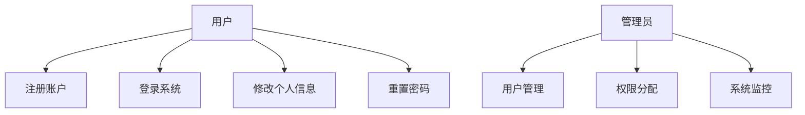
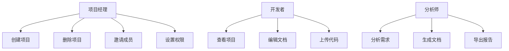
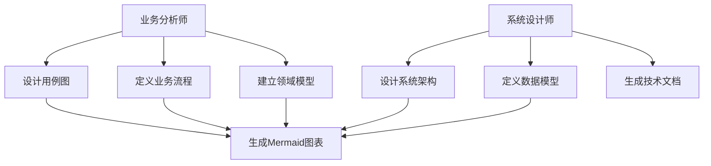
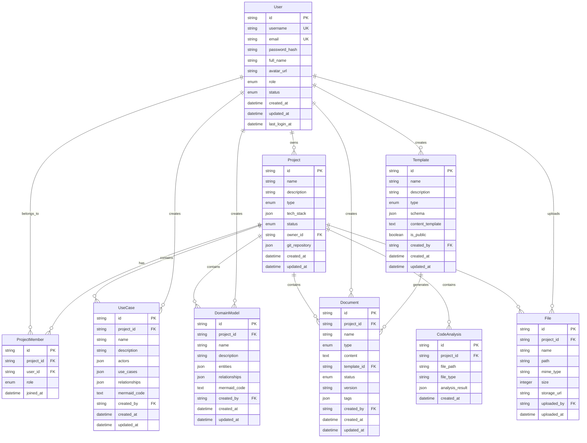

# 智能软件分析设计工具 - 后端接口需求文档

## 📋 项目概述

本文档定义了智能软件分析设计工具的后端API接口需求，包括功能树、用例图、数据模型、ER图和具体的API接口设计。

## 🌳 功能树

```
智能软件分析设计工具后端系统
├── 用户管理模块
│   ├── 用户注册/登录
│   ├── 用户信息管理
│   ├── 权限控制
│   └── 会话管理
├── 项目管理模块
│   ├── 项目创建/删除
│   ├── 项目信息管理
│   ├── 项目成员管理
│   └── 项目版本控制
├── 核心业务资产模块
│   ├── 用例图管理
│   │   ├── 参与者管理
│   │   ├── 用例管理
│   │   ├── 关系管理
│   │   └── 图表生成
│   ├── 领域模型管理
│   │   ├── 实体管理
│   │   ├── 属性管理
│   │   ├── 关系管理
│   │   └── 知识图谱生成
│   └── 业务流程管理
│       ├── 流程节点管理
│       ├── 流程连接管理
│       └── 流程图生成
├── 文档生成模块
│   ├── AI分析引擎
│   ├── 模板管理
│   ├── 文档生成器
│   └── 文档版本管理
├── 代码分析模块
│   ├── 代码上传处理
│   ├── 静态代码分析
│   ├── 依赖关系分析
│   └── 代码质量评估
├── 系统架构模块
│   ├── 模块管理
│   ├── 连接管理
│   ├── 分层管理
│   └── 架构图生成
├── 实体模型模块
│   ├── 数据库实体管理
│   ├── 字段管理
│   ├── 关系管理
│   └── SQL脚本生成
├── 文件管理模块
│   ├── 文件上传
│   ├── 文件存储
│   ├── 文件预览
│   └── 文件导出
├── Git集成模块
│   ├── 仓库连接
│   ├── 分支管理
│   ├── 提交管理
│   └── 同步管理
└── MCP协议模块
    ├── MCP服务器
    ├── Agent接口
    ├── 协议适配
    └── 插件管理
```

## 🎯 核心用例图

### 用户管理用例


### 项目管理用例


### 核心业务资产用例


## 🗄️ 数据模型设计

### 核心实体定义

#### 用户实体 (User)
```typescript
interface User {
  id: string;
  username: string;
  email: string;
  password_hash: string;
  full_name: string;
  avatar_url?: string;
  role: 'admin' | 'manager' | 'developer' | 'analyst';
  status: 'active' | 'inactive' | 'suspended';
  created_at: Date;
  updated_at: Date;
  last_login_at?: Date;
}
```

#### 项目实体 (Project)
```typescript
interface Project {
  id: string;
  name: string;
  description: string;
  type: 'web' | 'mobile' | 'desktop' | 'api' | 'other';
  tech_stack: string[];
  status: 'planning' | 'development' | 'testing' | 'completed' | 'archived';
  owner_id: string;
  git_repository?: {
    url: string;
    branch: string;
    access_token?: string;
  };
  created_at: Date;
  updated_at: Date;
}
```

#### 用例图实体 (UseCase)
```typescript
interface UseCase {
  id: string;
  project_id: string;
  name: string;
  description: string;
  actors: Actor[];
  use_cases: UseCaseItem[];
  relationships: Relationship[];
  mermaid_code: string;
  created_by: string;
  created_at: Date;
  updated_at: Date;
}

interface Actor {
  id: string;
  name: string;
  type: 'primary' | 'secondary' | 'system';
  description: string;
}

interface UseCaseItem {
  id: string;
  name: string;
  description: string;
  priority: 'high' | 'medium' | 'low';
  complexity: 'simple' | 'medium' | 'complex';
}

interface Relationship {
  id: string;
  source_id: string;
  target_id: string;
  type: 'association' | 'include' | 'extend' | 'generalization';
  description?: string;
}
```

#### 领域模型实体 (DomainModel)
```typescript
interface DomainModel {
  id: string;
  project_id: string;
  name: string;
  description: string;
  entities: DomainEntity[];
  relationships: DomainRelationship[];
  mermaid_code: string;
  created_by: string;
  created_at: Date;
  updated_at: Date;
}

interface DomainEntity {
  id: string;
  name: string;
  description: string;
  attributes: EntityAttribute[];
  methods: EntityMethod[];
  stereotype?: string;
}

interface EntityAttribute {
  id: string;
  name: string;
  type: string;
  description: string;
  is_key: boolean;
  is_required: boolean;
}

interface EntityMethod {
  id: string;
  name: string;
  description: string;
  parameters: string[];
  return_type: string;
}

interface DomainRelationship {
  id: string;
  source_entity_id: string;
  target_entity_id: string;
  type: 'association' | 'aggregation' | 'composition' | 'inheritance' | 'dependency';
  cardinality: string;
  description?: string;
}
```

#### 文档实体 (Document)
```typescript
interface Document {
  id: string;
  project_id: string;
  name: string;
  type: 'requirement' | 'design' | 'api' | 'user_manual' | 'technical' | 'custom';
  content: string;
  template_id?: string;
  status: 'draft' | 'review' | 'approved' | 'published';
  version: string;
  tags: string[];
  created_by: string;
  created_at: Date;
  updated_at: Date;
}
```

#### 代码分析实体 (CodeAnalysis)
```typescript
interface CodeAnalysis {
  id: string;
  project_id: string;
  file_path: string;
  file_type: string;
  analysis_result: {
    classes: ClassInfo[];
    functions: FunctionInfo[];
    dependencies: DependencyInfo[];
    metrics: CodeMetrics;
  };
  created_at: Date;
}

interface ClassInfo {
  name: string;
  methods: string[];
  properties: string[];
  extends?: string;
  implements?: string[];
}

interface FunctionInfo {
  name: string;
  parameters: string[];
  return_type: string;
  complexity: number;
}

interface DependencyInfo {
  source: string;
  target: string;
  type: 'import' | 'inheritance' | 'composition' | 'usage';
}

interface CodeMetrics {
  lines_of_code: number;
  cyclomatic_complexity: number;
  maintainability_index: number;
  technical_debt: number;
}
```

## 📊 ER图设计



## 🔌 API接口设计

### 基础配置
- **Base URL**: `https://api.design-tool.com/v1`
- **认证方式**: JWT Bearer Token
- **数据格式**: JSON
- **HTTP状态码**: 标准RESTful状态码

### 1. 用户管理API

#### 用户注册
```http
POST /auth/register
Content-Type: application/json

{
  "username": "string",
  "email": "string",
  "password": "string",
  "full_name": "string"
}

Response 201:
{
  "success": true,
  "data": {
    "user": {
      "id": "string",
      "username": "string",
      "email": "string",
      "full_name": "string",
      "role": "developer"
    },
    "token": "string"
  }
}
```

#### 用户登录
```http
POST /auth/login
Content-Type: application/json

{
  "email": "string",
  "password": "string"
}

Response 200:
{
  "success": true,
  "data": {
    "user": {
      "id": "string",
      "username": "string",
      "email": "string",
      "full_name": "string",
      "role": "developer"
    },
    "token": "string",
    "expires_in": 3600
  }
}
```

### 2. 项目管理API

#### 创建项目
```http
POST /projects
Authorization: Bearer {token}
Content-Type: application/json

{
  "name": "string",
  "description": "string",
  "type": "web",
  "tech_stack": ["React", "Node.js", "MongoDB"],
  "git_repository": {
    "url": "string",
    "branch": "main",
    "access_token": "string"
  }
}

Response 201:
{
  "success": true,
  "data": {
    "id": "string",
    "name": "string",
    "description": "string",
    "type": "web",
    "status": "planning",
    "created_at": "2024-01-01T00:00:00Z"
  }
}
```

#### 获取项目列表
```http
GET /projects?page=1&limit=10&status=active
Authorization: Bearer {token}

Response 200:
{
  "success": true,
  "data": {
    "projects": [
      {
        "id": "string",
        "name": "string",
        "description": "string",
        "type": "web",
        "status": "development",
        "created_at": "2024-01-01T00:00:00Z"
      }
    ],
    "pagination": {
      "page": 1,
      "limit": 10,
      "total": 25,
      "pages": 3
    }
  }
}
```

### 3. 用例图管理API

#### 创建用例图
```http
POST /projects/{projectId}/use-cases
Authorization: Bearer {token}
Content-Type: application/json

{
  "name": "用户管理用例图",
  "description": "描述用户注册、登录等功能",
  "actors": [
    {
      "id": "actor1",
      "name": "用户",
      "type": "primary",
      "description": "系统的主要使用者"
    }
  ],
  "use_cases": [
    {
      "id": "uc1",
      "name": "用户注册",
      "description": "新用户注册账户",
      "priority": "high",
      "complexity": "medium"
    }
  ],
  "relationships": [
    {
      "id": "rel1",
      "source_id": "actor1",
      "target_id": "uc1",
      "type": "association"
    }
  ]
}

Response 201:
{
  "success": true,
  "data": {
    "id": "string",
    "name": "用户管理用例图",
    "mermaid_code": "graph TB\n  User[用户] --> UC1[用户注册]",
    "created_at": "2024-01-01T00:00:00Z"
  }
}
```

#### 生成用例图Mermaid代码
```http
POST /projects/{projectId}/use-cases/{useCaseId}/generate-mermaid
Authorization: Bearer {token}

Response 200:
{
  "success": true,
  "data": {
    "mermaid_code": "graph TB\n  User[用户] --> UC1[用户注册]\n  User --> UC2[用户登录]",
    "svg_content": "<svg>...</svg>"
  }
}
```

### 4. 领域模型管理API

#### 创建领域模型
```http
POST /projects/{projectId}/domain-models
Authorization: Bearer {token}
Content-Type: application/json

{
  "name": "电商领域模型",
  "description": "电商系统的核心业务模型",
  "entities": [
    {
      "id": "entity1",
      "name": "User",
      "description": "用户实体",
      "attributes": [
        {
          "id": "attr1",
          "name": "id",
          "type": "string",
          "description": "用户ID",
          "is_key": true,
          "is_required": true
        }
      ],
      "methods": [
        {
          "id": "method1",
          "name": "login",
          "description": "用户登录",
          "parameters": ["email", "password"],
          "return_type": "boolean"
        }
      ]
    }
  ],
  "relationships": [
    {
      "id": "rel1",
      "source_entity_id": "entity1",
      "target_entity_id": "entity2",
      "type": "association",
      "cardinality": "1:N"
    }
  ]
}

Response 201:
{
  "success": true,
  "data": {
    "id": "string",
    "name": "电商领域模型",
    "mermaid_code": "classDiagram\n  class User {\n    +string id\n    +login(email, password) boolean\n  }",
    "created_at": "2024-01-01T00:00:00Z"
  }
}
```

### 5. 文档生成API

#### AI分析需求并生成文档
```http
POST /projects/{projectId}/documents/ai-generate
Authorization: Bearer {token}
Content-Type: application/json

{
  "requirements": "开发一个电商平台，包含用户管理、商品管理、订单管理等功能",
  "document_types": ["requirement", "design", "api"],
  "template_id": "template123",
  "options": {
    "include_diagrams": true,
    "detail_level": "high",
    "language": "zh-CN"
  }
}

Response 202:
{
  "success": true,
  "data": {
    "task_id": "string",
    "status": "processing",
    "estimated_time": 300
  }
}
```

#### 查询文档生成状态
```http
GET /projects/{projectId}/documents/generate-status/{taskId}
Authorization: Bearer {token}

Response 200:
{
  "success": true,
  "data": {
    "task_id": "string",
    "status": "completed",
    "progress": 100,
    "result": {
      "documents": [
        {
          "id": "string",
          "name": "需求规格说明书",
          "type": "requirement",
          "content": "...",
          "created_at": "2024-01-01T00:00:00Z"
        }
      ]
    }
  }
}
```

### 6. 代码分析API

#### 上传代码文件进行分析
```http
POST /projects/{projectId}/code-analysis/upload
Authorization: Bearer {token}
Content-Type: multipart/form-data

files: [File, File, ...]
options: {
  "analyze_dependencies": true,
  "generate_diagrams": true,
  "include_metrics": true
}

Response 202:
{
  "success": true,
  "data": {
    "task_id": "string",
    "status": "processing",
    "uploaded_files": 15
  }
}
```

#### 获取代码分析结果
```http
GET /projects/{projectId}/code-analysis/{taskId}
Authorization: Bearer {token}

Response 200:
{
  "success": true,
  "data": {
    "analysis_id": "string",
    "status": "completed",
    "result": {
      "file_structure": {
        "total_files": 25,
        "by_type": {
          "typescript": 15,
          "javascript": 8,
          "css": 2
        }
      },
      "classes": [
        {
          "name": "UserService",
          "methods": ["login", "register", "updateProfile"],
          "properties": ["users", "config"],
          "file_path": "src/services/UserService.ts"
        }
      ],
      "dependencies": [
        {
          "source": "UserService",
          "target": "DatabaseService",
          "type": "composition"
        }
      ],
      "metrics": {
        "total_lines": 5420,
        "complexity_score": 7.2,
        "maintainability_index": 85
      },
      "diagrams": {
        "class_diagram": "classDiagram\n  class UserService...",
        "dependency_diagram": "graph TD\n  UserService --> DatabaseService"
      }
    }
  }
}
```

### 7. 文件管理API

#### 上传文件
```http
POST /projects/{projectId}/files/upload
Authorization: Bearer {token}
Content-Type: multipart/form-data

file: File
metadata: {
  "description": "原型图文件",
  "tags": ["prototype", "ui"]
}

Response 201:
{
  "success": true,
  "data": {
    "id": "string",
    "name": "prototype.png",
    "size": 1024000,
    "mime_type": "image/png",
    "storage_url": "https://storage.example.com/files/...",
    "uploaded_at": "2024-01-01T00:00:00Z"
  }
}
```

### 8. Git集成API

#### 连接Git仓库
```http
POST /projects/{projectId}/git/connect
Authorization: Bearer {token}
Content-Type: application/json

{
  "repository_url": "https://github.com/user/repo.git",
  "branch": "main",
  "access_token": "github_token",
  "auto_sync": true
}

Response 200:
{
  "success": true,
  "data": {
    "connection_id": "string",
    "status": "connected",
    "last_sync": "2024-01-01T00:00:00Z"
  }
}
```

#### 提交文档到Git
```http
POST /projects/{projectId}/git/commit
Authorization: Bearer {token}
Content-Type: application/json

{
  "document_ids": ["doc1", "doc2"],
  "commit_message": "更新需求文档和设计文档",
  "branch": "feature/docs-update"
}

Response 202:
{
  "success": true,
  "data": {
    "commit_id": "string",
    "status": "processing"
  }
}
```

### 9. MCP协议API

#### MCP服务器状态
```http
GET /mcp/status
Authorization: Bearer {token}

Response 200:
{
  "success": true,
  "data": {
    "server_status": "running",
    "version": "1.0.0",
    "supported_protocols": ["mcp-1.0"],
    "available_tools": [
      "generate_use_case",
      "generate_domain_model",
      "analyze_code",
      "generate_document"
    ]
  }
}
```

#### MCP工具调用
```http
POST /mcp/tools/invoke
Authorization: Bearer {token}
Content-Type: application/json

{
  "tool_name": "generate_use_case",
  "parameters": {
    "requirements": "用户登录系统",
    "project_id": "project123"
  }
}

Response 200:
{
  "success": true,
  "data": {
    "tool_result": {
      "use_case_id": "string",
      "mermaid_code": "graph TB...",
      "actors": [...],
      "use_cases": [...]
    }
  }
}
```

## 🔒 安全性要求

### 认证与授权
- JWT Token认证，有效期24小时
- 基于角色的访问控制(RBAC)
- API密钥管理
- OAuth2.0集成支持

### 数据安全
- 敏感数据加密存储
- HTTPS强制传输
- 输入验证和SQL注入防护
- 文件上传安全检查

### 访问控制
- 项目级别权限控制
- 资源访问日志记录
- 频率限制(Rate Limiting)
- CORS配置

## 📈 性能要求

### 响应时间
- API响应时间 < 500ms
- 文件上传支持断点续传
- 大文件异步处理
- 缓存策略优化

### 并发处理
- 支持1000+并发用户
- 数据库连接池管理
- 队列系统处理耗时任务
- 负载均衡支持

### 可扩展性
- 微服务架构设计
- 水平扩展支持
- 数据库分片策略
- CDN集成

## 🧪 测试要求

### API测试
- 单元测试覆盖率 > 80%
- 集成测试覆盖核心流程
- 性能测试和压力测试
- 安全测试和渗透测试

### 文档要求
- OpenAPI 3.0规范
- Postman集合
- SDK和示例代码
- 错误码说明文档

---

*文档版本: v1.0*  
*最后更新: 2024年12月*  
*负责人: 后端开发团队*