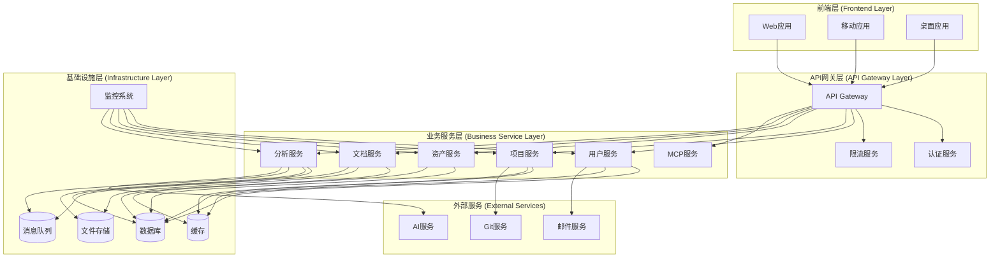
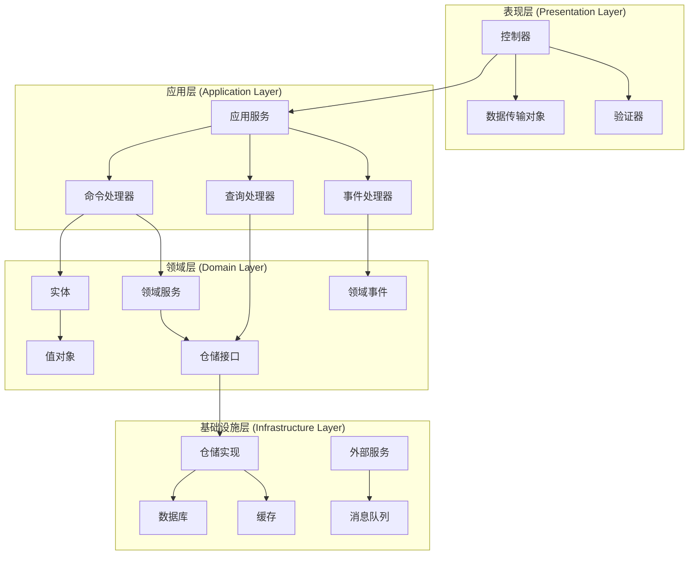
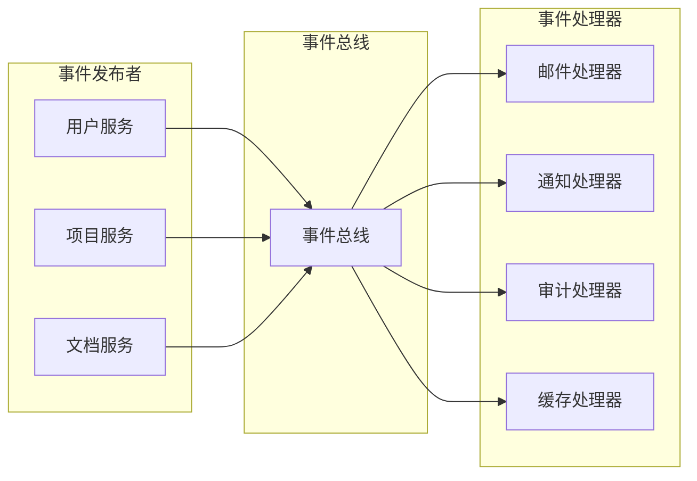
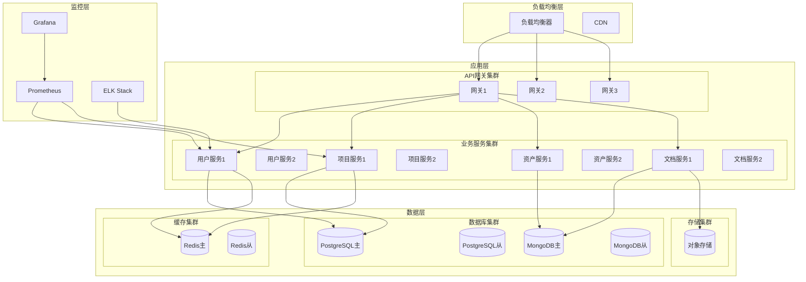
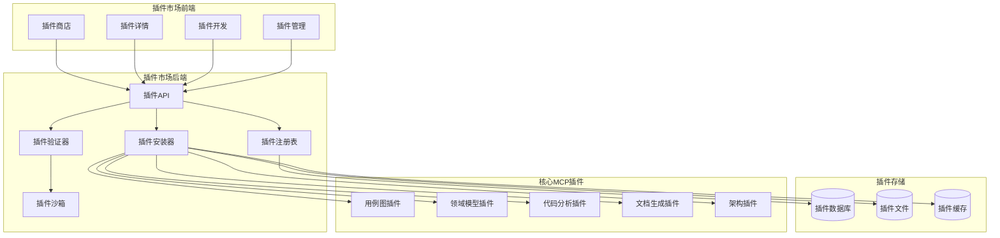
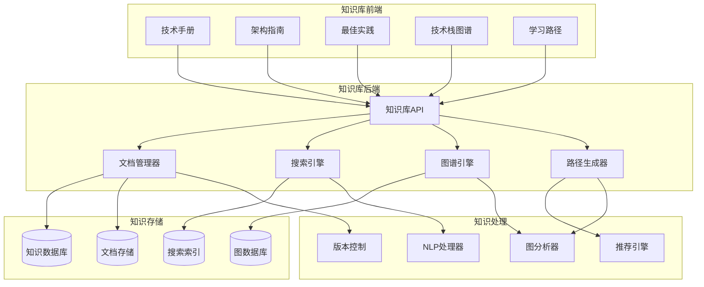

# 智能软件分析设计工具 - 后端架构文档

## 📋 架构概述

本文档详细描述了智能软件分析设计工具的后端架构设计，明确区分**开发技术架构**和**逻辑架构**两个维度：

- **开发技术架构 (Development Architecture)**: 技术栈选型、框架选择、工具链配置
- **逻辑架构 (Logical Architecture)**: 业务分层、模块划分、服务设计

同时包含微服务设计、部署架构、MCP插件生态和技术知识库系统的完整设计。

## 🏗️ 开发架构 (Development Architecture)

### 整体架构模式

采用**微服务架构 + 领域驱动设计(DDD)**的混合模式，确保系统的可扩展性、可维护性和业务领域的清晰分离。



### 技术栈选型

#### 核心框架
- **运行时**: Node.js 18+ (LTS)
- **Web框架**: Express.js / Fastify
- **语言**: TypeScript 5.0+
- **API文档**: OpenAPI 3.0 + Swagger

#### 数据存储
- **主数据库**: PostgreSQL 15+ (关系型数据)
- **文档数据库**: MongoDB 6.0+ (非结构化数据)
- **缓存**: Redis 7.0+ (会话、缓存)
- **搜索引擎**: Elasticsearch 8.0+ (全文搜索)
- **文件存储**: MinIO / AWS S3 (文件存储)

#### 消息与通信
- **消息队列**: RabbitMQ / Apache Kafka
- **实时通信**: Socket.IO / WebSocket
- **服务发现**: Consul / etcd
- **API网关**: Kong / Traefik

#### 监控与运维
- **日志**: Winston + ELK Stack
- **监控**: Prometheus + Grafana
- **链路追踪**: Jaeger / Zipkin
- **健康检查**: 自定义健康检查端点

#### 开发工具
- **包管理**: pnpm
- **代码质量**: ESLint + Prettier
- **测试框架**: Jest + Supertest
- **构建工具**: esbuild / SWC
- **容器化**: Docker + Docker Compose

### 项目结构设计

```
backend/
├── apps/                           # 应用服务
│   ├── api-gateway/               # API网关服务
│   │   ├── src/
│   │   │   ├── middleware/        # 中间件
│   │   │   ├── routes/           # 路由配置
│   │   │   ├── config/           # 配置文件
│   │   │   └── app.ts            # 应用入口
│   │   ├── Dockerfile
│   │   └── package.json
│   ├── user-service/              # 用户服务
│   ├── project-service/           # 项目服务
│   ├── asset-service/             # 资产服务
│   ├── document-service/          # 文档服务
│   ├── analysis-service/          # 分析服务
│   └── mcp-service/              # MCP协议服务
├── libs/                          # 共享库
│   ├── common/                   # 通用工具
│   │   ├── src/
│   │   │   ├── types/           # 类型定义
│   │   │   ├── utils/           # 工具函数
│   │   │   ├── constants/       # 常量定义
│   │   │   ├── errors/          # 错误处理
│   │   │   └── validators/      # 验证器
│   │   └── package.json
│   ├── database/                 # 数据库相关
│   │   ├── src/
│   │   │   ├── entities/        # 实体定义
│   │   │   ├── repositories/    # 仓储模式
│   │   │   ├── migrations/      # 数据库迁移
│   │   │   └── seeds/           # 种子数据
│   │   └── package.json
│   ├── auth/                     # 认证授权
│   ├── cache/                    # 缓存服务
│   ├── storage/                  # 文件存储
│   ├── queue/                    # 消息队列
│   └── monitoring/               # 监控日志
├── tools/                        # 开发工具
│   ├── scripts/                 # 脚本工具
│   ├── generators/              # 代码生成器
│   └── deployment/              # 部署配置
├── docs/                         # 文档
│   ├── api/                     # API文档
│   ├── architecture/            # 架构文档
│   └── deployment/              # 部署文档
├── tests/                        # 测试
│   ├── unit/                    # 单元测试
│   ├── integration/             # 集成测试
│   ├── e2e/                     # 端到端测试
│   └── performance/             # 性能测试
├── docker-compose.yml           # 本地开发环境
├── docker-compose.prod.yml      # 生产环境
├── package.json                 # 根包配置
├── pnpm-workspace.yaml         # 工作空间配置
└── README.md
```

## 🧠 逻辑架构 (Logical Architecture)

### 领域驱动设计 (DDD) 分层



### 核心业务领域设计

#### 1. 用户管理领域 (User Management Domain)

```typescript
// 领域实体
class User {
  private constructor(
    private readonly id: UserId,
    private username: Username,
    private email: Email,
    private profile: UserProfile,
    private role: UserRole,
    private status: UserStatus
  ) {}
  
  static create(data: CreateUserData): User {
    // 业务规则验证
    // 创建用户实体
  }
  
  changePassword(oldPassword: string, newPassword: string): void {
    // 密码变更业务逻辑
  }
  
  updateProfile(profile: UserProfile): void {
    // 个人信息更新业务逻辑
  }
  
  activate(): void {
    // 用户激活业务逻辑
  }
  
  deactivate(): void {
    // 用户停用业务逻辑
  }
}

// 值对象
class Email {
  constructor(private readonly value: string) {
    if (!this.isValid(value)) {
      throw new InvalidEmailError(value);
    }
  }
  
  private isValid(email: string): boolean {
    // 邮箱格式验证
  }
}

// 领域服务
class UserDomainService {
  constructor(
    private userRepository: UserRepository,
    private emailService: EmailService
  ) {}
  
  async registerUser(userData: RegisterUserData): Promise<User> {
    // 用户注册业务逻辑
    // 检查邮箱唯一性
    // 发送验证邮件
  }
  
  async authenticateUser(email: string, password: string): Promise<User> {
    // 用户认证业务逻辑
  }
}
```

#### 2. 项目管理领域 (Project Management Domain)

```typescript
// 聚合根
class Project {
  private constructor(
    private readonly id: ProjectId,
    private name: ProjectName,
    private description: string,
    private type: ProjectType,
    private owner: UserId,
    private members: ProjectMember[],
    private status: ProjectStatus,
    private gitRepository?: GitRepository
  ) {}
  
  static create(data: CreateProjectData): Project {
    // 项目创建业务逻辑
  }
  
  addMember(userId: UserId, role: ProjectRole): void {
    // 添加项目成员业务逻辑
  }
  
  removeMember(userId: UserId): void {
    // 移除项目成员业务逻辑
  }
  
  connectGitRepository(repository: GitRepository): void {
    // Git仓库连接业务逻辑
  }
  
  changeStatus(newStatus: ProjectStatus): void {
    // 项目状态变更业务逻辑
  }
}

// 实体
class ProjectMember {
  constructor(
    private readonly userId: UserId,
    private role: ProjectRole,
    private joinedAt: Date
  ) {}
  
  changeRole(newRole: ProjectRole): void {
    // 角色变更业务逻辑
  }
}
```

#### 3. 核心资产领域 (Core Asset Domain)

```typescript
// 用例图聚合
class UseCase {
  private constructor(
    private readonly id: UseCaseId,
    private readonly projectId: ProjectId,
    private name: string,
    private description: string,
    private actors: Actor[],
    private useCases: UseCaseItem[],
    private relationships: Relationship[]
  ) {}
  
  static create(data: CreateUseCaseData): UseCase {
    // 用例图创建业务逻辑
  }
  
  addActor(actor: Actor): void {
    // 添加参与者业务逻辑
  }
  
  addUseCase(useCase: UseCaseItem): void {
    // 添加用例业务逻辑
  }
  
  addRelationship(relationship: Relationship): void {
    // 添加关系业务逻辑
  }
  
  generateMermaidCode(): string {
    // 生成Mermaid代码业务逻辑
  }
}

// 领域模型聚合
class DomainModel {
  private constructor(
    private readonly id: DomainModelId,
    private readonly projectId: ProjectId,
    private name: string,
    private description: string,
    private entities: DomainEntity[],
    private relationships: DomainRelationship[]
  ) {}
  
  static create(data: CreateDomainModelData): DomainModel {
    // 领域模型创建业务逻辑
  }
  
  addEntity(entity: DomainEntity): void {
    // 添加实体业务逻辑
  }
  
  addRelationship(relationship: DomainRelationship): void {
    // 添加关系业务逻辑
  }
  
  generateKnowledgeGraph(): string {
    // 生成知识图谱业务逻辑
  }
}
```

#### 4. 文档生成领域 (Document Generation Domain)

```typescript
// 文档聚合
class Document {
  private constructor(
    private readonly id: DocumentId,
    private readonly projectId: ProjectId,
    private name: string,
    private type: DocumentType,
    private content: DocumentContent,
    private template: Template,
    private status: DocumentStatus,
    private version: DocumentVersion
  ) {}
  
  static create(data: CreateDocumentData): Document {
    // 文档创建业务逻辑
  }
  
  updateContent(content: DocumentContent): void {
    // 内容更新业务逻辑
  }
  
  publish(): void {
    // 文档发布业务逻辑
  }
  
  createNewVersion(): DocumentVersion {
    // 版本创建业务逻辑
  }
}

// 文档生成服务
class DocumentGenerationService {
  constructor(
    private aiService: AIService,
    private templateEngine: TemplateEngine,
    private documentRepository: DocumentRepository
  ) {}
  
  async generateFromRequirements(
    requirements: string,
    projectId: ProjectId,
    documentTypes: DocumentType[]
  ): Promise<Document[]> {
    // AI驱动的文档生成业务逻辑
  }
  
  async generateFromTemplate(
    template: Template,
    data: any,
    projectId: ProjectId
  ): Promise<Document> {
    // 模板驱动的文档生成业务逻辑
  }
}
```

### 事件驱动架构



#### 核心领域事件

```typescript
// 用户领域事件
class UserRegisteredEvent {
  constructor(
    public readonly userId: string,
    public readonly email: string,
    public readonly occurredAt: Date
  ) {}
}

class UserActivatedEvent {
  constructor(
    public readonly userId: string,
    public readonly occurredAt: Date
  ) {}
}

// 项目领域事件
class ProjectCreatedEvent {
  constructor(
    public readonly projectId: string,
    public readonly ownerId: string,
    public readonly projectName: string,
    public readonly occurredAt: Date
  ) {}
}

class ProjectMemberAddedEvent {
  constructor(
    public readonly projectId: string,
    public readonly userId: string,
    public readonly role: string,
    public readonly occurredAt: Date
  ) {}
}

// 文档领域事件
class DocumentGeneratedEvent {
  constructor(
    public readonly documentId: string,
    public readonly projectId: string,
    public readonly documentType: string,
    public readonly occurredAt: Date
  ) {}
}

class DocumentPublishedEvent {
  constructor(
    public readonly documentId: string,
    public readonly version: string,
    public readonly occurredAt: Date
  ) {}
}
```

## 🔧 服务架构设计

### 微服务拆分策略

#### 1. API网关服务 (api-gateway)
**职责**: 统一入口、路由转发、认证授权、限流熔断

```typescript
// API网关配置
interface GatewayConfig {
  routes: RouteConfig[];
  middleware: MiddlewareConfig[];
  rateLimit: RateLimitConfig;
  auth: AuthConfig;
}

interface RouteConfig {
  path: string;
  method: string;
  service: string;
  endpoint: string;
  auth: boolean;
  rateLimit?: number;
}
```

#### 2. 用户服务 (user-service)
**职责**: 用户管理、认证授权、权限控制

```typescript
// 用户服务接口
interface UserService {
  register(userData: RegisterUserData): Promise<User>;
  login(credentials: LoginCredentials): Promise<AuthResult>;
  updateProfile(userId: string, profile: UserProfile): Promise<User>;
  changePassword(userId: string, passwordData: ChangePasswordData): Promise<void>;
  getUserById(userId: string): Promise<User>;
  getUsersByProject(projectId: string): Promise<User[]>;
}
```

#### 3. 项目服务 (project-service)
**职责**: 项目管理、成员管理、权限控制

```typescript
// 项目服务接口
interface ProjectService {
  createProject(projectData: CreateProjectData): Promise<Project>;
  updateProject(projectId: string, updateData: UpdateProjectData): Promise<Project>;
  deleteProject(projectId: string): Promise<void>;
  addMember(projectId: string, userId: string, role: ProjectRole): Promise<void>;
  removeMember(projectId: string, userId: string): Promise<void>;
  getProjectsByUser(userId: string): Promise<Project[]>;
}
```

#### 4. 资产服务 (asset-service)
**职责**: 核心业务资产管理（用例图、领域模型、业务流程）

```typescript
// 资产服务接口
interface AssetService {
  createUseCase(projectId: string, useCaseData: CreateUseCaseData): Promise<UseCase>;
  updateUseCase(useCaseId: string, updateData: UpdateUseCaseData): Promise<UseCase>;
  generateUseCaseMermaid(useCaseId: string): Promise<string>;
  
  createDomainModel(projectId: string, modelData: CreateDomainModelData): Promise<DomainModel>;
  updateDomainModel(modelId: string, updateData: UpdateDomainModelData): Promise<DomainModel>;
  generateDomainModelMermaid(modelId: string): Promise<string>;
  
  createBusinessProcess(projectId: string, processData: CreateBusinessProcessData): Promise<BusinessProcess>;
  generateProcessMermaid(processId: string): Promise<string>;
}
```

#### 5. 文档服务 (document-service)
**职责**: 文档生成、模板管理、版本控制

```typescript
// 文档服务接口
interface DocumentService {
  generateDocumentFromAI(requirements: string, projectId: string, types: DocumentType[]): Promise<GenerationTask>;
  generateDocumentFromTemplate(templateId: string, data: any, projectId: string): Promise<Document>;
  updateDocument(documentId: string, content: string): Promise<Document>;
  publishDocument(documentId: string): Promise<Document>;
  getDocumentHistory(documentId: string): Promise<DocumentVersion[]>;
  exportDocument(documentId: string, format: ExportFormat): Promise<Buffer>;
}
```

#### 6. 分析服务 (analysis-service)
**职责**: 代码分析、静态分析、依赖分析

```typescript
// 分析服务接口
interface AnalysisService {
  analyzeCodeFiles(projectId: string, files: File[]): Promise<AnalysisTask>;
  getAnalysisResult(taskId: string): Promise<AnalysisResult>;
  generateClassDiagram(analysisId: string): Promise<string>;
  generateDependencyDiagram(analysisId: string): Promise<string>;
  calculateMetrics(analysisId: string): Promise<CodeMetrics>;
}
```

#### 7. MCP服务 (mcp-service)
**职责**: MCP协议实现、Agent接口、工具调用

```typescript
// MCP服务接口
interface MCPService {
  getServerInfo(): Promise<MCPServerInfo>;
  listTools(): Promise<MCPTool[]>;
  invokeTool(toolName: string, parameters: any): Promise<MCPToolResult>;
  handleAgentRequest(request: MCPRequest): Promise<MCPResponse>;
}
```

### 数据一致性策略

#### 1. 事务管理
- **本地事务**: 单服务内使用数据库事务
- **分布式事务**: 使用Saga模式处理跨服务事务
- **最终一致性**: 通过事件驱动实现数据同步

#### 2. Saga模式实现

```typescript
// Saga编排器
class DocumentGenerationSaga {
  constructor(
    private projectService: ProjectService,
    private assetService: AssetService,
    private documentService: DocumentService,
    private aiService: AIService
  ) {}
  
  async execute(command: GenerateDocumentCommand): Promise<void> {
    try {
      // 步骤1: 验证项目权限
      await this.projectService.validateAccess(command.projectId, command.userId);
      
      // 步骤2: 获取项目资产
      const assets = await this.assetService.getProjectAssets(command.projectId);
      
      // 步骤3: AI分析生成
      const analysis = await this.aiService.analyzeRequirements(command.requirements, assets);
      
      // 步骤4: 生成文档
      const documents = await this.documentService.generateDocuments(analysis, command.types);
      
      // 步骤5: 发布事件
      await this.eventBus.publish(new DocumentsGeneratedEvent(documents));
      
    } catch (error) {
      // 补偿操作
      await this.compensate(command, error);
      throw error;
    }
  }
  
  private async compensate(command: GenerateDocumentCommand, error: Error): Promise<void> {
    // 实现补偿逻辑
  }
}
```

## 🚀 部署架构 (Deployment Architecture)

### 容器化部署



### Docker Compose配置

```yaml
# docker-compose.prod.yml
version: '3.8'

services:
  # API网关
  api-gateway:
    build: ./apps/api-gateway
    ports:
      - "3000:3000"
    environment:
      - NODE_ENV=production
      - JWT_SECRET=${JWT_SECRET}
      - REDIS_URL=${REDIS_URL}
    depends_on:
      - redis
      - user-service
      - project-service
    deploy:
      replicas: 3
      resources:
        limits:
          memory: 512M
        reservations:
          memory: 256M
  
  # 用户服务
  user-service:
    build: ./apps/user-service
    environment:
      - NODE_ENV=production
      - DATABASE_URL=${USER_DB_URL}
      - REDIS_URL=${REDIS_URL}
    depends_on:
      - postgres
      - redis
    deploy:
      replicas: 2
      resources:
        limits:
          memory: 1G
        reservations:
          memory: 512M
  
  # 项目服务
  project-service:
    build: ./apps/project-service
    environment:
      - NODE_ENV=production
      - DATABASE_URL=${PROJECT_DB_URL}
      - REDIS_URL=${REDIS_URL}
    depends_on:
      - postgres
      - redis
    deploy:
      replicas: 2
  
  # 资产服务
  asset-service:
    build: ./apps/asset-service
    environment:
      - NODE_ENV=production
      - MONGODB_URL=${MONGODB_URL}
      - REDIS_URL=${REDIS_URL}
    depends_on:
      - mongodb
      - redis
    deploy:
      replicas: 2
  
  # 文档服务
  document-service:
    build: ./apps/document-service
    environment:
      - NODE_ENV=production
      - MONGODB_URL=${MONGODB_URL}
      - S3_ENDPOINT=${S3_ENDPOINT}
      - AI_SERVICE_URL=${AI_SERVICE_URL}
    depends_on:
      - mongodb
      - minio
      - rabbitmq
    deploy:
      replicas: 2
  
  # 分析服务
  analysis-service:
    build: ./apps/analysis-service
    environment:
      - NODE_ENV=production
      - MONGODB_URL=${MONGODB_URL}
      - S3_ENDPOINT=${S3_ENDPOINT}
    depends_on:
      - mongodb
      - minio
      - rabbitmq
    deploy:
      replicas: 2
  
  # MCP服务
  mcp-service:
    build: ./apps/mcp-service
    ports:
      - "3001:3001"
    environment:
      - NODE_ENV=production
      - MCP_PORT=3001
    depends_on:
      - user-service
      - project-service
      - asset-service
      - document-service
    deploy:
      replicas: 1
  
  # 数据库
  postgres:
    image: postgres:15
    environment:
      - POSTGRES_DB=design_tool
      - POSTGRES_USER=${DB_USER}
      - POSTGRES_PASSWORD=${DB_PASSWORD}
    volumes:
      - postgres_data:/var/lib/postgresql/data
    deploy:
      replicas: 1
      resources:
        limits:
          memory: 2G
        reservations:
          memory: 1G
  
  mongodb:
    image: mongo:6.0
    environment:
      - MONGO_INITDB_ROOT_USERNAME=${MONGO_USER}
      - MONGO_INITDB_ROOT_PASSWORD=${MONGO_PASSWORD}
    volumes:
      - mongodb_data:/data/db
    deploy:
      replicas: 1
  
  redis:
    image: redis:7-alpine
    volumes:
      - redis_data:/data
    deploy:
      replicas: 1
  
  # 文件存储
  minio:
    image: minio/minio:latest
    command: server /data --console-address ":9001"
    environment:
      - MINIO_ROOT_USER=${MINIO_USER}
      - MINIO_ROOT_PASSWORD=${MINIO_PASSWORD}
    volumes:
      - minio_data:/data
    ports:
      - "9000:9000"
      - "9001:9001"
  
  # 消息队列
  rabbitmq:
    image: rabbitmq:3-management
    environment:
      - RABBITMQ_DEFAULT_USER=${RABBITMQ_USER}
      - RABBITMQ_DEFAULT_PASS=${RABBITMQ_PASSWORD}
    volumes:
      - rabbitmq_data:/var/lib/rabbitmq
    ports:
      - "15672:15672"
  
  # 监控
  prometheus:
    image: prom/prometheus:latest
    volumes:
      - ./monitoring/prometheus.yml:/etc/prometheus/prometheus.yml
      - prometheus_data:/prometheus
    ports:
      - "9090:9090"
  
  grafana:
    image: grafana/grafana:latest
    environment:
      - GF_SECURITY_ADMIN_PASSWORD=${GRAFANA_PASSWORD}
    volumes:
      - grafana_data:/var/lib/grafana
    ports:
      - "3001:3000"
    depends_on:
      - prometheus

volumes:
  postgres_data:
  mongodb_data:
  redis_data:
  minio_data:
  rabbitmq_data:
  prometheus_data:
  grafana_data:

networks:
  default:
    driver: bridge
```

### Kubernetes部署配置

```yaml
# k8s/namespace.yaml
apiVersion: v1
kind: Namespace
metadata:
  name: design-tool

---
# k8s/api-gateway-deployment.yaml
apiVersion: apps/v1
kind: Deployment
metadata:
  name: api-gateway
  namespace: design-tool
spec:
  replicas: 3
  selector:
    matchLabels:
      app: api-gateway
  template:
    metadata:
      labels:
        app: api-gateway
    spec:
      containers:
      - name: api-gateway
        image: design-tool/api-gateway:latest
        ports:
        - containerPort: 3000
        env:
        - name: NODE_ENV
          value: "production"
        - name: JWT_SECRET
          valueFrom:
            secretKeyRef:
              name: app-secrets
              key: jwt-secret
        resources:
          requests:
            memory: "256Mi"
            cpu: "250m"
          limits:
            memory: "512Mi"
            cpu: "500m"
        livenessProbe:
          httpGet:
            path: /health
            port: 3000
          initialDelaySeconds: 30
          periodSeconds: 10
        readinessProbe:
          httpGet:
            path: /ready
            port: 3000
          initialDelaySeconds: 5
          periodSeconds: 5

---
# k8s/api-gateway-service.yaml
apiVersion: v1
kind: Service
metadata:
  name: api-gateway-service
  namespace: design-tool
spec:
  selector:
    app: api-gateway
  ports:
  - protocol: TCP
    port: 80
    targetPort: 3000
  type: LoadBalancer
```

## 📊 性能与扩展性设计

### 缓存策略

```typescript
// 多层缓存架构
class CacheManager {
  constructor(
    private l1Cache: MemoryCache,    // 内存缓存 (最快)
    private l2Cache: RedisCache,     // Redis缓存 (快)
    private l3Cache: DatabaseCache   // 数据库缓存 (慢)
  ) {}
  
  async get<T>(key: string): Promise<T | null> {
    // L1缓存查找
    let value = await this.l1Cache.get<T>(key);
    if (value) return value;
    
    // L2缓存查找
    value = await this.l2Cache.get<T>(key);
    if (value) {
      await this.l1Cache.set(key, value, 60); // 1分钟
      return value;
    }
    
    // L3缓存查找
    value = await this.l3Cache.get<T>(key);
    if (value) {
      await this.l2Cache.set(key, value, 300); // 5分钟
      await this.l1Cache.set(key, value, 60);  // 1分钟
      return value;
    }
    
    return null;
  }
  
  async set<T>(key: string, value: T, ttl: number): Promise<void> {
    await Promise.all([
      this.l1Cache.set(key, value, Math.min(ttl, 60)),
      this.l2Cache.set(key, value, Math.min(ttl, 300)),
      this.l3Cache.set(key, value, ttl)
    ]);
  }
}
```

### 数据库优化

```sql
-- 索引优化策略

-- 用户表索引
CREATE INDEX CONCURRENTLY idx_users_email ON users(email);
CREATE INDEX CONCURRENTLY idx_users_username ON users(username);
CREATE INDEX CONCURRENTLY idx_users_status_created ON users(status, created_at);

-- 项目表索引
CREATE INDEX CONCURRENTLY idx_projects_owner ON projects(owner_id);
CREATE INDEX CONCURRENTLY idx_projects_status ON projects(status);
CREATE INDEX CONCURRENTLY idx_projects_created ON projects(created_at DESC);

-- 项目成员表索引
CREATE INDEX CONCURRENTLY idx_project_members_project ON project_members(project_id);
CREATE INDEX CONCURRENTLY idx_project_members_user ON project_members(user_id);
CREATE UNIQUE INDEX CONCURRENTLY idx_project_members_unique ON project_members(project_id, user_id);

-- 文档表索引
CREATE INDEX CONCURRENTLY idx_documents_project ON documents(project_id);
CREATE INDEX CONCURRENTLY idx_documents_type_status ON documents(type, status);
CREATE INDEX CONCURRENTLY idx_documents_created ON documents(created_at DESC);
CREATE INDEX CONCURRENTLY idx_documents_fulltext ON documents USING gin(to_tsvector('english', name || ' ' || content));
```

### 异步处理架构

```typescript
// 队列处理器
class QueueProcessor {
  constructor(
    private queue: Queue,
    private processors: Map<string, JobProcessor>
  ) {}
  
  async start(): Promise<void> {
    this.queue.process('document-generation', 5, this.processDocumentGeneration.bind(this));
    this.queue.process('code-analysis', 3, this.processCodeAnalysis.bind(this));
    this.queue.process('email-sending', 10, this.processEmailSending.bind(this));
  }
  
  private async processDocumentGeneration(job: Job): Promise<void> {
    const processor = this.processors.get('document-generation');
    if (!processor) throw new Error('Processor not found');
    
    await processor.process(job.data);
  }
  
  private async processCodeAnalysis(job: Job): Promise<void> {
    const processor = this.processors.get('code-analysis');
    if (!processor) throw new Error('Processor not found');
    
    await processor.process(job.data);
  }
  
  private async processEmailSending(job: Job): Promise<void> {
    const processor = this.processors.get('email-sending');
    if (!processor) throw new Error('Processor not found');
    
    await processor.process(job.data);
  }
}

// 文档生成处理器
class DocumentGenerationProcessor implements JobProcessor {
  constructor(
    private aiService: AIService,
    private documentService: DocumentService,
    private notificationService: NotificationService
  ) {}
  
  async process(data: DocumentGenerationJobData): Promise<void> {
    try {
      // 更新任务状态
      await this.updateTaskStatus(data.taskId, 'processing', 0);
      
      // AI分析
      await this.updateTaskStatus(data.taskId, 'processing', 25);
      const analysis = await this.aiService.analyzeRequirements(data.requirements);
      
      // 生成文档
      await this.updateTaskStatus(data.taskId, 'processing', 50);
      const documents = await this.documentService.generateDocuments(analysis, data.types);
      
      // 保存结果
      await this.updateTaskStatus(data.taskId, 'processing', 75);
      await this.documentService.saveDocuments(documents);
      
      // 完成任务
      await this.updateTaskStatus(data.taskId, 'completed', 100);
      
      // 发送通知
      await this.notificationService.sendDocumentGenerationComplete(data.userId, documents);
      
    } catch (error) {
      await this.updateTaskStatus(data.taskId, 'failed', 0, error.message);
      await this.notificationService.sendDocumentGenerationFailed(data.userId, error.message);
      throw error;
    }
  }
  
  private async updateTaskStatus(
    taskId: string,
    status: string,
    progress: number,
    error?: string
  ): Promise<void> {
    // 更新任务状态逻辑
  }
}
```

## 🔒 安全架构设计

### 认证授权架构

```typescript
// JWT认证中间件
class JWTAuthMiddleware {
  constructor(
    private jwtService: JWTService,
    private userService: UserService,
    private cacheService: CacheService
  ) {}
  
  async authenticate(req: Request, res: Response, next: NextFunction): Promise<void> {
    try {
      const token = this.extractToken(req);
      if (!token) {
        throw new UnauthorizedError('Token not provided');
      }
      
      // 验证Token
      const payload = await this.jwtService.verify(token);
      
      // 检查Token黑名单
      const isBlacklisted = await this.cacheService.get(`blacklist:${token}`);
      if (isBlacklisted) {
        throw new UnauthorizedError('Token is blacklisted');
      }
      
      // 获取用户信息
      const user = await this.userService.getUserById(payload.userId);
      if (!user || user.status !== 'active') {
        throw new UnauthorizedError('User not found or inactive');
      }
      
      // 设置请求上下文
      req.user = user;
      req.token = token;
      
      next();
    } catch (error) {
      res.status(401).json({ error: error.message });
    }
  }
  
  private extractToken(req: Request): string | null {
    const authHeader = req.headers.authorization;
    if (authHeader && authHeader.startsWith('Bearer ')) {
      return authHeader.substring(7);
    }
    return null;
  }
}

// RBAC权限控制
class RBACMiddleware {
  constructor(private permissionService: PermissionService) {}
  
  requirePermission(resource: string, action: string) {
    return async (req: Request, res: Response, next: NextFunction): Promise<void> => {
      try {
        const user = req.user;
        if (!user) {
          throw new UnauthorizedError('User not authenticated');
        }
        
        const hasPermission = await this.permissionService.checkPermission(
          user.id,
          resource,
          action,
          req.params.projectId
        );
        
        if (!hasPermission) {
          throw new ForbiddenError('Insufficient permissions');
        }
        
        next();
      } catch (error) {
        res.status(403).json({ error: error.message });
      }
    };
  }
}
```

### 数据加密策略

```typescript
// 数据加密服务
class EncryptionService {
  constructor(
    private encryptionKey: string,
    private hashSalt: string
  ) {}
  
  // 敏感数据加密
  encrypt(data: string): string {
    const cipher = crypto.createCipher('aes-256-cbc', this.encryptionKey);
    let encrypted = cipher.update(data, 'utf8', 'hex');
    encrypted += cipher.final('hex');
    return encrypted;
  }
  
  // 敏感数据解密
  decrypt(encryptedData: string): string {
    const decipher = crypto.createDecipher('aes-256-cbc', this.encryptionKey);
    let decrypted = decipher.update(encryptedData, 'hex', 'utf8');
    decrypted += decipher.final('utf8');
    return decrypted;
  }
  
  // 密码哈希
  hashPassword(password: string): string {
    return crypto.pbkdf2Sync(password, this.hashSalt, 10000, 64, 'sha512').toString('hex');
  }
  
  // 密码验证
  verifyPassword(password: string, hash: string): boolean {
    const hashedPassword = this.hashPassword(password);
    return hashedPassword === hash;
  }
}
```

## 📈 监控与运维

### 健康检查

```typescript
// 健康检查服务
class HealthCheckService {
  constructor(
    private database: Database,
    private redis: Redis,
    private queue: Queue
  ) {}
  
  async checkHealth(): Promise<HealthStatus> {
    const checks = await Promise.allSettled([
      this.checkDatabase(),
      this.checkRedis(),
      this.checkQueue(),
      this.checkMemory(),
      this.checkDisk()
    ]);
    
    const results = checks.map((check, index) => ({
      name: ['database', 'redis', 'queue', 'memory', 'disk'][index],
      status: check.status === 'fulfilled' ? 'healthy' : 'unhealthy',
      details: check.status === 'fulfilled' ? check.value : check.reason
    }));
    
    const overallStatus = results.every(r => r.status === 'healthy') ? 'healthy' : 'unhealthy';
    
    return {
      status: overallStatus,
      timestamp: new Date().toISOString(),
      checks: results
    };
  }
  
  private async checkDatabase(): Promise<any> {
    const start = Date.now();
    await this.database.query('SELECT 1');
    const duration = Date.now() - start;
    return { duration, status: 'connected' };
  }
  
  private async checkRedis(): Promise<any> {
    const start = Date.now();
    await this.redis.ping();
    const duration = Date.now() - start;
    return { duration, status: 'connected' };
  }
  
  private async checkQueue(): Promise<any> {
    const waiting = await this.queue.waiting();
    const active = await this.queue.active();
    const failed = await this.queue.failed();
    return { waiting, active, failed };
  }
  
  private async checkMemory(): Promise<any> {
    const usage = process.memoryUsage();
    const total = os.totalmem();
    const free = os.freemem();
    return {
      process: usage,
      system: { total, free, used: total - free }
    };
  }
  
  private async checkDisk(): Promise<any> {
    // 磁盘使用情况检查
    return { usage: '75%', available: '25GB' };
  }
}
```

### 日志架构

```typescript
// 结构化日志服务
class LoggerService {
  private logger: winston.Logger;
  
  constructor() {
    this.logger = winston.createLogger({
      level: 'info',
      format: winston.format.combine(
        winston.format.timestamp(),
        winston.format.errors({ stack: true }),
        winston.format.json()
      ),
      defaultMeta: {
        service: process.env.SERVICE_NAME || 'unknown',
        version: process.env.SERVICE_VERSION || '1.0.0'
      },
      transports: [
        new winston.transports.Console(),
        new winston.transports.File({ filename: 'logs/error.log', level: 'error' }),
        new winston.transports.File({ filename: 'logs/combined.log' })
      ]
    });
  }
  
  info(message: string, meta?: any): void {
    this.logger.info(message, meta);
  }
  
  error(message: string, error?: Error, meta?: any): void {
    this.logger.error(message, { error: error?.stack, ...meta });
  }
  
  warn(message: string, meta?: any): void {
    this.logger.warn(message, meta);
  }
  
  debug(message: string, meta?: any): void {
    this.logger.debug(message, meta);
  }
  
  // 业务日志
  logUserAction(userId: string, action: string, resource: string, meta?: any): void {
    this.info('User action', {
      userId,
      action,
      resource,
      timestamp: new Date().toISOString(),
      ...meta
    });
  }
  
  logAPICall(method: string, path: string, statusCode: number, duration: number, userId?: string): void {
    this.info('API call', {
      method,
      path,
      statusCode,
      duration,
      userId,
      timestamp: new Date().toISOString()
    });
  }
}
```

## 🔌 MCP插件生态系统架构

### 插件市场架构设计



### 插件架构实现

```typescript
// 插件接口定义
interface MCPPlugin {
  id: string;
  name: string;
  version: string;
  description: string;
  author: string;
  category: PluginCategory;
  dependencies: string[];
  permissions: PluginPermission[];
  
  // 插件生命周期
  install(): Promise<void>;
  activate(): Promise<void>;
  deactivate(): Promise<void>;
  uninstall(): Promise<void>;
  
  // 插件功能
  execute(command: string, params: any): Promise<any>;
  getCommands(): PluginCommand[];
  getSchema(): JSONSchema7;
}

// 插件注册表
class PluginRegistry {
  private plugins: Map<string, MCPPlugin> = new Map();
  private pluginMetadata: Map<string, PluginMetadata> = new Map();
  
  async registerPlugin(plugin: MCPPlugin): Promise<void> {
    // 验证插件
    await this.validatePlugin(plugin);
    
    // 检查依赖
    await this.checkDependencies(plugin.dependencies);
    
    // 注册插件
    this.plugins.set(plugin.id, plugin);
    this.pluginMetadata.set(plugin.id, {
      id: plugin.id,
      name: plugin.name,
      version: plugin.version,
      status: 'registered',
      registeredAt: new Date()
    });
    
    // 发布插件注册事件
    await this.eventBus.publish('plugin.registered', { pluginId: plugin.id });
  }
  
  async installPlugin(pluginId: string): Promise<void> {
    const plugin = this.plugins.get(pluginId);
    if (!plugin) {
      throw new PluginNotFoundError(pluginId);
    }
    
    // 安装插件
    await plugin.install();
    
    // 更新状态
    const metadata = this.pluginMetadata.get(pluginId)!;
    metadata.status = 'installed';
    metadata.installedAt = new Date();
    
    // 发布插件安装事件
    await this.eventBus.publish('plugin.installed', { pluginId });
  }
  
  async activatePlugin(pluginId: string): Promise<void> {
    const plugin = this.plugins.get(pluginId);
    if (!plugin) {
      throw new PluginNotFoundError(pluginId);
    }
    
    // 激活插件
    await plugin.activate();
    
    // 更新状态
    const metadata = this.pluginMetadata.get(pluginId)!;
    metadata.status = 'active';
    metadata.activatedAt = new Date();
    
    // 发布插件激活事件
    await this.eventBus.publish('plugin.activated', { pluginId });
  }
  
  getActivePlugins(): MCPPlugin[] {
    return Array.from(this.plugins.values()).filter(plugin => {
      const metadata = this.pluginMetadata.get(plugin.id);
      return metadata?.status === 'active';
    });
  }
}

// 插件沙箱
class PluginSandbox {
  private vm: NodeVM;
  
  constructor() {
    this.vm = new NodeVM({
      console: 'inherit',
      sandbox: {},
      require: {
        external: true,
        builtin: ['path', 'crypto'],
        root: './plugins/',
        mock: {
          fs: {
            readFileSync: this.mockReadFile.bind(this)
          }
        }
      },
      timeout: 30000 // 30秒超时
    });
  }
  
  async executePlugin(pluginCode: string, params: any): Promise<any> {
    try {
      const result = await this.vm.run(pluginCode, 'plugin.js');
      return result;
    } catch (error) {
      throw new PluginExecutionError(error.message);
    }
  }
  
  private mockReadFile(path: string): string {
    // 限制文件访问权限
    if (!path.startsWith('./plugins/')) {
      throw new Error('Access denied');
    }
    return fs.readFileSync(path, 'utf8');
  }
}
```

## 📚 技术知识库系统架构

### 知识库架构设计



### 知识库实现

```typescript
// 知识图谱管理
class KnowledgeGraph {
  constructor(
    private graphDB: Neo4jDatabase,
    private nlpProcessor: NLPProcessor
  ) {}
  
  async createTechStackNode(techStack: TechStack): Promise<void> {
    const query = `
      CREATE (t:TechStack {
        id: $id,
        name: $name,
        category: $category,
        description: $description,
        version: $version,
        popularity: $popularity,
        learningCurve: $learningCurve,
        createdAt: datetime()
      })
    `;
    
    await this.graphDB.run(query, techStack);
  }
  
  async createDependencyRelation(from: string, to: string, type: DependencyType): Promise<void> {
    const query = `
      MATCH (a:TechStack {id: $from}), (b:TechStack {id: $to})
      CREATE (a)-[:DEPENDS_ON {type: $type, createdAt: datetime()}]->(b)
    `;
    
    await this.graphDB.run(query, { from, to, type });
  }
  
  async generateLearningPath(startTech: string, targetTech: string): Promise<LearningPath> {
    const query = `
      MATCH path = shortestPath((start:TechStack {id: $startTech})-[*]-(target:TechStack {id: $targetTech}))
      RETURN path
    `;
    
    const result = await this.graphDB.run(query, { startTech, targetTech });
    return this.buildLearningPath(result);
  }
  
  async findRelatedTechnologies(techId: string, depth: number = 2): Promise<TechStack[]> {
    const query = `
      MATCH (t:TechStack {id: $techId})-[*1..$depth]-(related:TechStack)
      RETURN DISTINCT related
      ORDER BY related.popularity DESC
      LIMIT 20
    `;
    
    const result = await this.graphDB.run(query, { techId, depth });
    return result.records.map(record => record.get('related').properties);
  }
}

// 技术手册管理
class TechHandbookManager {
  constructor(
    private documentStore: DocumentStore,
    private searchEngine: SearchEngine,
    private versionControl: VersionControl
  ) {}
  
  async createHandbook(handbook: TechHandbook): Promise<string> {
    // 生成文档ID
    const id = this.generateId();
    
    // 保存文档
    await this.documentStore.save(id, handbook);
    
    // 建立搜索索引
    await this.searchEngine.index(id, {
      title: handbook.title,
      content: handbook.content,
      tags: handbook.tags,
      category: handbook.category
    });
    
    // 版本控制
    await this.versionControl.createVersion(id, handbook, 'Initial version');
    
    return id;
  }
  
  async updateHandbook(id: string, updates: Partial<TechHandbook>, message: string): Promise<void> {
    // 获取当前版本
    const current = await this.documentStore.get(id);
    
    // 应用更新
    const updated = { ...current, ...updates, updatedAt: new Date() };
    
    // 保存更新
    await this.documentStore.save(id, updated);
    
    // 更新搜索索引
    await this.searchEngine.update(id, {
      title: updated.title,
      content: updated.content,
      tags: updated.tags,
      category: updated.category
    });
    
    // 创建新版本
    await this.versionControl.createVersion(id, updated, message);
  }
  
  async searchHandbooks(query: string, filters?: SearchFilters): Promise<SearchResult[]> {
    return await this.searchEngine.search(query, {
      ...filters,
      type: 'handbook'
    });
  }
  
  async getHandbookVersions(id: string): Promise<Version[]> {
    return await this.versionControl.getVersions(id);
  }
}

// 学习路径生成器
class LearningPathGenerator {
  constructor(
    private knowledgeGraph: KnowledgeGraph,
    private recommendEngine: RecommendEngine
  ) {}
  
  async generatePath(userProfile: UserProfile, targetSkills: string[]): Promise<LearningPath> {
    // 分析用户当前技能
    const currentSkills = userProfile.skills;
    
    // 计算技能差距
    const skillGaps = this.calculateSkillGaps(currentSkills, targetSkills);
    
    // 生成学习路径
    const paths = await Promise.all(
      skillGaps.map(gap => this.knowledgeGraph.generateLearningPath(gap.from, gap.to))
    );
    
    // 优化路径
    const optimizedPath = this.optimizePath(paths, userProfile.preferences);
    
    // 添加推荐资源
    const pathWithResources = await this.addLearningResources(optimizedPath);
    
    return pathWithResources;
  }
  
  private calculateSkillGaps(current: Skill[], target: string[]): SkillGap[] {
    // 技能差距分析逻辑
    return target.map(targetSkill => {
      const closestSkill = this.findClosestSkill(current, targetSkill);
      return {
        from: closestSkill?.id || 'beginner',
        to: targetSkill,
        difficulty: this.calculateDifficulty(closestSkill, targetSkill)
      };
    });
  }
  
  private async addLearningResources(path: LearningPath): Promise<LearningPath> {
    // 为每个学习节点添加推荐资源
    for (const node of path.nodes) {
      node.resources = await this.recommendEngine.getResources(node.skillId, {
        type: ['tutorial', 'documentation', 'course'],
        difficulty: node.difficulty
      });
    }
    
    return path;
  }
}
```

---

*文档版本: v2.0*  
*最后更新: 2024年12月*  
*架构师: 后端架构团队*  
*新增: MCP插件生态系统 + 技术知识库系统*